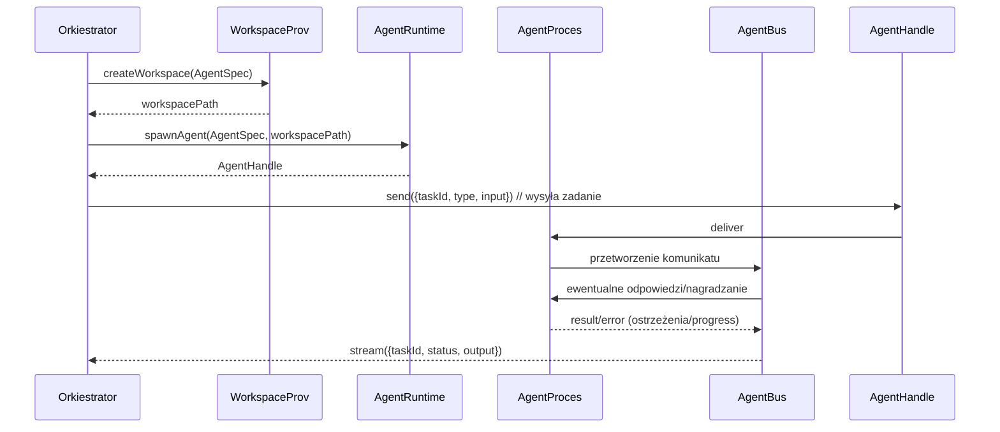
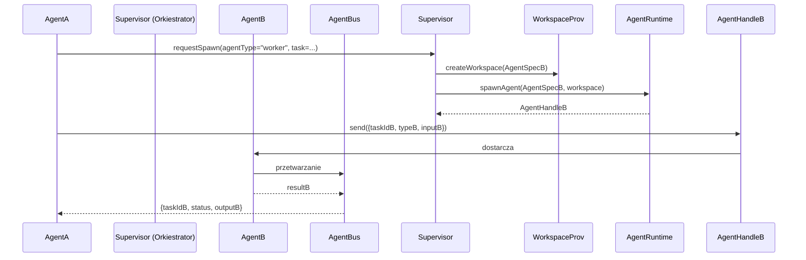
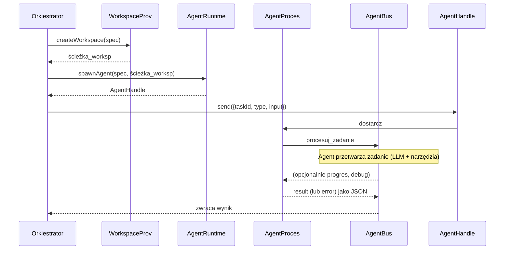
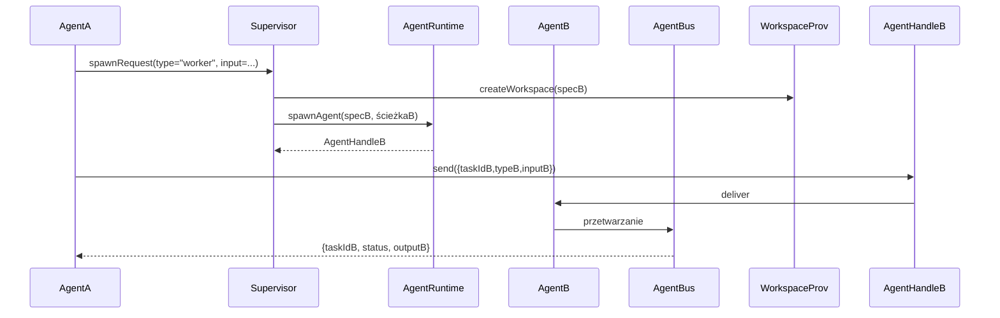

# Architektura orkiestracji agentów (nadbudowa nad **pi-agent-core**)

## Podsumowanie wykonawcze  
Przedstawiona architektura zakłada **wielowarstwowe rozdzielenie** odpowiedzialności: nadrzędny agent-kurator (supervisor) zarządza cyklem życia i komunikacją z wieloma podagentami (subagents). Każdy podagent ma własną **specyfikację** (`AgentSpec`), środowisko pracy (`Workspace`) i instancję wykonawczą (`AgentRuntime`), a wyniki przekazuje w postaci **ustrukturyzowanych artefaktów** (np. patch kodu, raport, wyniki testów). Komunikacja odbywa się przez zunifikowaną magistralę komunikatów z wyraźnymi ID korelacji, a wszystkie zadania, postępy i wyniki definiujemy za pomocą **schematów** (np. JSON Schema). Dodatkowo zapewniamy **obserwowalność** (panelem `tmux` lub interfejsem, logi, metryki, śledzenie OTEL) oraz **izolację** środowisk (worktrees, kontenery itp.) dla bezpieczeństwa.  

## Kluczowe koncepcje architektury  
Architekturę można sprowadzić do kilku abstrakcji:

- **`AgentSpec`** – deklaratywna specyfikacja agenta zawierająca jego rolę, systemowy prompt, zestaw narzędzi, model, workspace itp. (np. YAML z polami `name`, `description`, `tools`, `model`).  
- **`WorkspaceProvider`** – fabryka środowisk pracy (oddzielne katalogi robocze) dla każdego agenta. Może to być bieżące repozytorium, Git worktree, pełne klonowanie, tymczasowy katalog itp. Każda implementacja ma inny stopień izolacji i kosztów (por. tabela poniżej).  
- **`AgentRuntime`** – mechanizm uruchamiania agenta. Przykłady: proces lokalny (np. `spawn('pi')`), sesja `tmux`, kontener Docker, instancja zdalna (SSH, kubernetesa). Powinna zapewniać interface do wysyłania/zatrzymywania procesu agenta.  
- **`AgentHandle`** – uchwyt do aktywnego agenta („klient” w kodzie), pozwalający na wysyłanie komunikatów i odbieranie wyników. Uwaga: pan `tmux` to tylko adapter interfejsu wizualnego, a nie kanał komunikacji – cała wymiana odbywa się przez magistralę.  
- **Magistrala komunikacyjna (`AgentBus`)** – abstrakcja kanału: umożliwia wysyłanie asynchronicznych wiadomości *send*, żądań *request* oraz strumieni odpowiedzi *stream*. Każda wiadomość zawiera unikalne ID korelacji (np. `requestId`), co pozwala koordynatorowi dopasować wyniki do zadań. Poprawa niezawodności przez timeouty i ewentualne ponowienia żądań leży po stronie implementacji magistrali.  

Te komponenty tworzą elastyczną bazę: nadbudowana jest nad nią konkretna logika (np. **pi-coding-agent**), ale sama magistrala i flow są aplikacyjnie agnostyczne. Dzięki temu można testować różne runtime’y czy magazyny workspace bez zmiany logiki orkiestratora.  

## Schematy komunikatów i walidacja  
Wszystkie ważne komunikaty definiujemy jako schematy (np. **JSON Schema** lub Protobuf). Umożliwia to statyczną walidację wejść i wyjść: jak pokazano w literaturze, schematy drastycznie redukują błędy generatywnego modelu.  

Przykładowe schematy JSON:  

```json
// Przykładowy schemat zadania (request) dla agenta
{
  "type": "object",
  "properties": {
    "taskId": {"type": "string"},      // UUID zadania
    "agent": {"type": "string"},       // nazwa/typ agenta docelowego
    "type": {"type": "string"},        // np. "analysis", "test", "review"
    "input": {                        // dane specyficzne dla zadania
      "type": "object",
      "properties": {
        "query": {"type": "string"}
      },
      "required": ["query"],
      "additionalProperties": false
    }
  },
  "required": ["taskId", "agent", "type", "input"],
  "additionalProperties": false
}
```

```json
// Schemat komunikatu z wynikiem lub błędem
{
  "type": "object",
  "properties": {
    "taskId": {"type": "string"},
    "agent": {"type": "string"},
    "status": {"enum": ["completed","failed"]},
    "output": {
      "type": "object",
      "properties": {
        "artifactType": {"type": "string"},
        "data": {}             // struktura zależna od artifactType (patrz dalej)
      },
      "required": ["artifactType","data"]
    },
    "error": {
      "type": "object",
      "properties": {
        "code": {"type": "string"},
        "message": {"type": "string"}
      },
      "required": ["code","message"]
    }
  },
  "required": ["taskId","agent","status"]
}
```

Walidację można przeprowadzić za pomocą JSON Schema (np. biblioteka `ajv`), Protobuf (z dedykowaną serializacją) czy systemów typów języka (TypeScript + TypeBox, Python + Pydantic itp.). Kluczowa zasada: *ściśle określać* wymagane pola i typy, żeby model i podagent nigdy nie przekroczyły granic formatu.  

Przykład komunikatu YAML (żądanie zadania):  

```yaml
taskId: "a1b2c3d4"
agent: "researcher"
type: "codeReview"
input:
  repository: "https://github.com/example/proj"
  issueId: 42
```  

## Przepływ uruchamiania agenta (spawn flow)  
Diagram sekwencji pokazuje proces uruchomienia agenta i zwrócenia wyniku:



1. **AgentSpec**: Orkiestrator na podstawie żądania tworzy specyfikację agenta (id, rola, prompt, narzędzia, workspace).  
2. **WorkspaceProvider**: Przydziela izolowany katalog roboczy (np. Git worktree, pełne clone lub tmp folder) zgodnie z konfiguracją Spec.  
3. **AgentRuntime**: Odpala agenta – np. uruchamia nowy proces `pi` ze wskazaniem katalogu, rolem i promptem. Zwraca uchwyt (`AgentHandle`) do komunikacji. W `pi-coding-agent` takim uchwytem jest proces child, ewentualnie z panelem `tmux`.  
4. **Komunikacja**: Orkiestrator wysyła do AgentHandle’a żądanie zadania jako zserializowany JSON. Agent (podagent) je odbiera, wykonuje pętlę agent-core, korzysta z narzędzi itp. W razie problemów publikuje postępy lub błędy.  
5. **Wynik**: Po zakończeniu podagent zwraca strukturę (JSON) zawierającą `taskId` i artefakt/komunikat. Ponieważ przykładowa implementacja używa trybu JSON („pi --mode json”), mamy ustrukturyzowany output.  

Analogicznie działa delegacja: jeśli podagent sam musi stworzyć dalej kolejne „pod-podagent” (np. planista deleguje wykonanie), to sam tworzy `AgentSpec` i używa lokalnego AgentBus lub ponownie komunikuje się przez nadrzędnego. Sytuację delegacji widać na kolejnym diagramie:



Tutaj AgentA „prosi” Supervisor o uruchomienie AgentB i wysyła mu zadanie. AgentBus zapewnia, że wynik (lub błąd) dotrze z powrotem do AgentA (z odpowiednim `taskId`).  

## Komunikacja i API magistrali  
Magistrala komunikacyjna to core orkiestratora. Proponujemy model podobny do wzorca *message bus*:

- **`send(dest, message)`** – bezpośrednie wysłanie asynchroniczne (fire-and-forget). Nie oczekujemy odpowiedzi (użyteczne dla eventów).  
- **`request(dest, request)`** – wysłanie żądania z oczekiwaniem na odpowiedź. Żądanie zawiera unikalne `requestId`, a odpowiedź (wkrótce) wraca do nadawcy z tym samym `requestId`. Pozwala to na *request/reply* z korelacją.  
- **`stream(dest, message)`** – strumień wielu wiadomości (np. postęp pracy, kolejne części dużego wyniku). Nadawca może oznaczać koniec strumienia (EOF) lub używać `status: completed/failed`.  

Wszystkie komunikaty umieszczamy w formacie JSON z polami meta (source, dest, requestId) oraz dane biznesowe. Ustalamy timeouty (np. przerwij po kilku sekundach, ew. ponów próby). Retry sensowne tylko dla zadań idempotentnych lub sterowanych przez agenta (można cofać do kolejki nadrzędnej i próbować ponownie). Konwencja może wzorować się np. na **JSON-RPC 2.0** (gdzie `id` spaja request z odpowiedzią) albo własnym lekkim protokole.  

Schematy wiadomości:  

```yaml
# Przykład żądania TaskRequest
{
  "messageType": "TaskRequest",
  "payload": { ...validated input zgodny z AgentSpec... },
  "requestId": "uuid-1234",
  "replyTo": "Orchestrator"
}
```

```yaml
# Przykład aktualizacji postępu TaskProgress
{
  "messageType": "TaskProgress",
  "requestId": "uuid-1234",
  "status": "running",
  "progress": {
    "percent": 0.5,
    "note": "Inicjalizacja narzędzi"
  },
  "timestamp": "2026-06-21T12:00:00Z"
}
```

```yaml
# Przykład zakończenia TaskResult
{
  "messageType": "TaskResult",
  "requestId": "uuid-1234",
  "status": "completed",
  "result": {
    "artifactType": "patch",
    "data": {
      "diff": "... znormalizowany diff ...",
      "baseRevision": "abc123",
      "newRevision": "def456"
    }
  }
}
```

```yaml
# Przykład komunikatu o błędzie TaskError
{
  "messageType": "TaskError",
  "requestId": "uuid-1234",
  "status": "failed",
  "error": {
    "code": "ToolCrash",
    "message": "Błąd podczas wykonania narzędzia 'bash': zasób nie znaleziony"
  }
}
```

Każdy agent z zewnątrz widzi wynik tylko w postaci tych struktur – unikamy *czarnej skrzynki* tekstu. Dzięki temu supervisor może dalej przetwarzać te artefakty programowo lub błyskawicznie zgłaszać błąd.  

## Artefakty (rezultaty) i ich formaty  
Wynikiem działania agenta nie powinien być długi tekst (jak w standardowej sesji czatowej), lecz **ustrukturyzowany artefakt**:

- **Patch kodu** – możemy użyć np. formatu *unified diff* (tekstowego) albo JSON Patch (RFC6902). Przykład: `artifactType: "patch"`, `data: {"diff": "...", "targetPath": "src/main.py"}`.  
- **Raport/opis** – np. Markdown lub JSON z polami `title`, `summary`, `details`. Przykład: `artifactType: "report"`, `data: {"title":"Analiza bezpieczeństwa","summary":"...", "reportMd": "..."}`.  
- **Wyniki testów** – struktura zawierająca liczbę testów, wynik, być może JUnit/XML lub JSON (`{"passed":10,"failed":2,"details":[...]}`). `artifactType: "testResults"`.  
- **Inne** – np. konkretne pliki wyjściowe, dane binarne, czy checkpointy. Wszystko zależy od narzędzi. Formatujemy je konsystentnie.

Klucz: jasna kontraktualizacja. Agent powinien zwracać znormalizowane JSONY, nawet jeśli ostateczną postacią tekstową będzie Markdown (można traktować go jako `detailsMarkdown`). W ten sposób orkiestrowanie ma zawsze stabilny interfejs.  

## Stany cyklu życia agenta  
Nadrzędny agent powinien śledzić stan każdego podagenta. Można przyjąć stany: 

- **Spawned** – agent utworzony (workspace przygotowany, proces uruchamiany).  
- **Running** – agent aktywny, przetwarza zadanie.  
- **Waiting** – agent oczekuje na zadanie (np. z kolejkowania lub czeka na wynik podrzędnego agenta).  
- **Completed** – zakończył zadanie pomyślnie (wynik dostępny).  
- **Failed** – zakończył się błędem (np. wyjątek, timeout).  

Supervisor rejestruje te zmiany (np. w strukturze AgentHandle) i publikuje eventy (np. `agent_spawned`, `agent_completed`, `agent_failed`). Dla zadań równoległych lub łańcuchowych statusy można zbierać i agregować, aby np. pokazać w UI „2/3 wykonane, 1 w toku” jak w przykładzie rozszerzenia. Agent sam przetwarza także eventy sterujące (np. przerwania).  

## Sekwencje i diagramy  
Poniżej uproszczone diagramy przedstawiające kluczowe scenariusze:

**1. Spawning i pełen cykl:** nadrzędny agent orkiestrator tworzy spec, uruchamia agenta, wysyła zadanie, odbiera wynik.



**2. Delegacja (pod-agent):** agent A deleguje Agentowi B część pracy i czeka na wynik.



Diagramy te ilustrują koordynację poprzez abstrakcje. Zwróć uwagę, że *tmux* to tylko opcja wizualna – w praktyce AgentHandle komunikuje się przez magistralę (AgentBus).  

## Przykłady formatów JSON/YAML  
**Przykład żądania (JSON):**
```json
{
  "messageType": "TaskRequest",
  "payload": {
    "taskId": "abc-123",
    "type": "find-vulnerabilities",
    "input": {
      "files": ["src/main.py","src/util.py"]
    }
  },
  "requestId": "req-001",
  "replyTo": "orchestrator"
}
```

**Przykład odpowiedzi (JSON):**
```json
{
  "messageType": "TaskResult",
  "payload": {
    "taskId": "abc-123",
    "status": "completed",
    "result": {
      "artifactType": "report",
      "data": {
        "summary": "Znaleziono 2 podatności",
        "reportMd": "- Problem w lini 10\n- Brak obsługi błędu w X"
      }
    }
  },
  "requestId": "req-001"
}
```

## Rekomendowane transporty i ich wady/zalety  
**Lokalne IPC (pipes, UNIX-socket):**  
- *Plusy:* Bardzo wydajne, proste do wdrożenia przy procesach lokalnych (np. `spawn`).  
- *Minusy:* Ograniczone do tej samej maszyny i często jednorazowego połączenia. Brak elastyczności dla rozproszonego systemu.  

**HTTP/REST:**  
- *Plusy:* Prosty i uniwersalny, dużo gotowych bibliotek, łatwo firewallować.  
- *Minusy:* Nadmiar nagłówków i narzut protokolar, każde request/response osobne połączenie (chyba że stosujemy HTTP keep-alive). Ma opóźnienia (handshake). Dobre dla komunikacji między usługami sieciowymi.  

**WebSocket:**  
- *Plusy:* Dwukierunkowy kanał, dobre wsparcie w przeglądarkach i serwerach. Pozwala na pushowanie aktualizacji (progres, logi) w czasie rzeczywistym.  
- *Minusy:* Więcej komplikacji (utrzymywanie połączenia, ping-pong). Nie nadaje się do prostych batchowych zadań bez stromego kurzu architektury.  

**Redis Pub/Sub / Streams:**  
- *Plusy:* Lekki broker, proste pub/sub. Umożliwia rozproszone publish-subscribe (wiele instancji subskrybuje kanały). Redis Streams pozwala na **trwałe** kolejki komunikatów. .  
- *Minusy:* Pub/Sub w Redisie nie gwarantuje doręczenia ani trwałości. Łatwość użycia vs. brak zaawansowanych funkcji (bez Redis Streams). Potrzebny osobny serwis Redis.  

**NATS:**  
- *Plusy:* Wysoka wydajność i lekkość, wbudowane wzorce pub/sub, request/reply i kolejki (JetStream). Pod-milisekundowe opóźnienia. Skalowalność w klastrach. Oficjalne klienty dla wielu języków.  
- *Minusy:* Wymaga uruchomienia serwera NATS. Nie jest tak rozpowszechniony jak HTTP. Dość nowy ekosystem, ale zyskujący na popularności.  

**gRPC / Protobuf:**  
- *Plus:* Szybkie serializacje, wsparcie stubów, proste metody request/reply z wygenerowanymi kodami.  
- *Minus:* JSON-less (binarny), trudniejszy do debugowania, wymaga definicji .proto (mniej elastyczny schema-less). Za to pewny kontrakt.  

Dobór zależy od skali. Dla **lokalnego** rozwiązania „łokciowego” najlepszy jest po prostu pipe/JSON albo nawet `tmux` ze stdin/stdout (Pi oferuje tryb RPC na stdin/stdout). W systemie rozproszonym warto użyć NATS lub HTTP. Redis jest ok do małych eventów, ale w przypadku krytycznej kolejki warto rozważyć JetStream lub dedykowany brokera.  

## Obserwowalność systemu  
Dobry projekt musi mieć **pełną widoczność** w działaniu agentów. Obejmuje to:  
- **Panele `tmux`/UI:** każdy AgentHandle można przydzielić do osobnej sesji `tmux` lub panelu terminala, co daje *żywy podgląd* na logi i postęp. Dzięki temu widzimy strumień wyjścia agenta (tak jak w przykładzie subagentów Pi) – „pełną widoczność w czasie rzeczywistym”. Taka mapa „process → pane” jest utrzymywana przez adapter obserwowalności, więc wewnętrznie komunikaty dalej płyną magistralą, a `tmux` to tylko monitor.  
- **Logi:** każde zdarzenie (start/zakończenie agenta, wywołanie narzędzia, błąd) zapisujemy w logach (najlepiej strukturalnych JSON lub OTLP). Można też agregować do centralnego ELK/Loki itp. Podprocesy mogą pisać stderr/stdout do plików lub przekazać je przez magistralę do nadrzędnego loggowania.  
- **Metryki:** np. liczba zadań, czas wykonania agenta, liczba tokenów czy zapytań narzędzi. Można to mierzyć ręcznie lub użyć rozszerzenia OTLP jak [pi-otel].  
- **Tracing (OpenTelemetry):** idealnie – każdy turn/wywołanie agenta opakować w span. Na przykład `pi-otel` buduje drzewo śladów: root span to interakcja, podsfery to kolejne wywołania LLM i narzędzi. Tak można śledzić gdzie czas się pali (opóźnienia narzędzi, duże prompty). Wartosći z narzędzi i modeli trafiają jako atrybuty spanów.  
- **Session ID i korelacja:** sprawnie dopasowujemy logi/metryki do agentów przez identyfikatory sesji i `taskId`. W połączeniu z TMUX można opatrzyć każdy panel nazwą agenta lub taskId.  

W praktyce: nakładamy *warstwę obserwowalności* powyżej `AgentRuntime`. Np. adapter `TmuxAdapter` rezerwuje nowy panel, ustawia prompt agenta, łączy STDOUT procesu z panelem. Parallelnie agent publikuje eventy na OTLP, a nadrzędny proces sczytuje i wypisuje je w logach lub do narzędzi APM. Dzięki takiemu podejściu utrzymujemy stałą kontrolę nad agentami i łatwo diagnozujemy problemy (narzędzia np. pokazują błędy tak samo jak wyniki).  

## Bezpieczeństwo i izolacja  
Domyślnie **Pi** działa bez sandboxingu – ma uprawnienia bieżącego użytkownika. W praktyce należy zadbać o bezpieczeństwo:  

- **Workspaces:** każdemu agentowi nadajemy odizolowane repozytorium/worktree. Możemy użyć **Git Worktrees** – szybkie (dziedziczą stan repo), niskie narzuty, ale *słaba izolacja* (wciąż ten sam .git). Można też pełni *klon* repozytorium do tymczasowego katalogu (wyższe koszty I/O, ale pełna separacja plików). Ewentualnie pipeline bez repo – nowy katalog z kopią plików.  
- **Chroot / Kontenery:** najpewniejsze. Każdy agent uruchomiony w osobnym chroot lub kontenerze Docker/POD. W trybie kontenera cały proces Pi i jego narzędzia wykonują się w odgrodzonym środowisku plików i sieci. Pi opisuje wzorce containerizacji (micro-VM „Gondolin”, zwykły Docker, OpenShell) dla izolacji.  
- **Ograniczenia narzędzi:** można wprowadzić whitelisty/blacklisty narzędzi. Np. dla agenta analitycznego udostępnić tylko `read`/`grep`, a zabronić `bash` czy `network`. Pi nie robi tego domyślnie, ale rozszerzenia mogą blokować wywołania.  
- **Uprawnienia systemowe:** można użytkownika Pi uprawnić tylko do potrzebnych katalogów (np. tylko `read` w katalogu projektu, brak sudo). W kontenerze łatwo ustalić użytkownika bez sudo.  
- **Model ML i dane poufne:** jeśli używamy kluczy API, rozważmy trzymanie ich poza sandboxem (np. OpenShell pozwala maskować klucze przez bramkę).  

Przykładowo, Pi sugeruje następujące podejścia: trzymać cały proces w Dockerze dla prostoty (iluizoluje FS) lub użyć „Gondolin” – mikro-VM dla built-in narzędzi. Takie wzorce minimalizują ryzyko, że agent np. usunie pliki spoza swojego katalogu czy przesle dane gdzie popadnie.  

## Plan implementacji MVP i kamienie milowe  
Kroki do minimalnego wdrożenia:  
1. **Definicja specyfikacji agentów:** opracować format `AgentSpec` (np. YAML) z polami: `name`, `role`, `prompt`, `model`, `tools`, `workspaceType`. Umożliwić łatwe rozszerzanie.  
2. **WorkspaceProvider – prototyp:** zaimplementować dwa rodzaje: „worktree” (git) i „clone” (kopiuj repo). Testować tworzenie i czyszczenie.  
3. **AgentRuntime – prototyp:** lokalny proces: wywołanie `pi --mode rpc` z przekierowaniem STDIN/STDOUT. Zwraca uchwyt z input/output. Potem rozszerzyć o opcję `tmux`: *Adapter Tmux* buduje nowe okno/panel i kieruje do niego proces.  
4. **AgentBus – prototyp:** prosty JSONL-over-stdin stdout (RPC) lub biblioteka pub/sub (np. Redis lub ZeroMQ) do pośrednictwa. Startowo może być synchronizowany (czekaj na result) lub asynchroniczny *Promise*-based.  
5. **Spawn/await API:** zaimplementować w nadrzędnym agencie narzędzia (np. `!spawnAgent` i `!awaitAgent`) do uruchomienia i czekania na wynik podagenta.  
6. **Schematy i walidacja:** przygotować JSON Schema dla typowych zadań (przykłady: analiza kodu, testy). Zintegrować walidator.  
7. **Logika delegacji:** sprawdzić prostą sekwencję: agent główny dzieli zadanie, czeka na outcome subagenta, integruje wynik.  
8. **Observability:** podłączyć stdout do paneli / zapisywać logi. Dodać rozszerzenia do OTEL (opcjonalnie).  
9. **Bezpieczeństwo:** wybrać strategię izolacji (np. first: `git worktree` + zwykły proces; potem Docker). Przetestować, że proces nie ucieka poza katalog.  

Kamienie milowe:  
- MVP1: „Spawnujących” agentów z komunikacją request/response (bez UI).  
- MVP2: Równoległe zadania i delegacje (z JSON stream wyników).  
- MVP3: Integracja z tmux UI (oddzielne okna).  
- MVP4: Monitoring + isolacja (docker).  

Każdy mileston zawiera testy integracji: czy `AgentResult` trafia do orkiestora i jest walidowany.  

## Porównanie implementacji WorkspaceProvider i AgentRuntime

| **Implementacja**        | **Złożoność**     | **Izolacja**      | **Wydajność**         | **Obserwowalność**    |
|-------------------------|-------------------|-------------------|-----------------------|-----------------------|
| **WorkspaceProvider:**  |                   |                   |                       |                       |
| – Current dir           | Niska            | Niska            | Wysoka (brak kopiowania) | Umiarkowana (prost. logi) |
| – Git worktree          | Średnia          | Niska (domenie .git) | Wysoka (minimalny narzut) | Umiarkowana            |
| – Git clone             | Średnia          | Średnia–Wysoka (oddzielne repo) | Niska (kopiowanie)  | Umiarkowana            |
| – Tmp dir / zip         | Niska–Średnia    | Średnia          | Niska (kopiowanie)     | Umiarkowana            |
| **AgentRuntime:**       |                   |                   |                       |                       |
| – Proces lokalny        | Niska            | Niska            | Wysoka                | Umiarkowana            |
| – Tmux pane             | Niska            | Niska            | Wysoka                | Wysoka (interaktywny podgląd) |
| – Docker/kontener       | Wysoka           | Wysoka           | Średnia (overhead kontenera) | Niska (bez dodatk. narz.) |
| – VM/Kubernetes         | Bardzo wysoka    | Bardzo wysoka    | Niska (duży narzut)   | Niska                   |
| – Zdalny (SSH/ws)       | Wysoka           | Zależne od zdalnej maszyny | Niska (sieć)     | Niska (zależnie od kanału) |

Tabela obrazuje, że najprostsze konfiguracje (worktree + proces) mają wysoką wydajność kosztem izolacji. Jeśli potrzebujemy bezpieczeństwa, Docker/VM dają większą separację, ale obniżają szybkość i utrudniają wizualizację (poza logami). `tmux` najwyżej zwiększa obserwowalność kosztem minimalnym (dodaje UI).  

## Źródła i odniesienia  
Powyższe rekomendacje opierają się na **pierwotnych źródłach Pi** (dokumentacja, przykładowe rozszerzenia) oraz standardach branżowych. Na przykład, Pi zachęca do użycia *trybu JSON* dla ustrukturyzowanej wymiany danych. Architekt Pi od autora kodu wskazuje zasadę „spawn via bash/tmux dla pełnej widoczności”. Bezpieczeństwo, domyślnie brakuje sandboksu – dlatego Pi proponuje scenariusze z Dockerem czy OpenShell. Dodatkowo, wzorzec walidacji JSON Schema jest silnie zalecany przez praktyków (np. Michaela Lanham) jako szybkie rozwiązanie na „flaky” wyjścia modeli. Różne opcje transportów popierają analizy ruchu sieciowego: Redis Pub/Sub daje prostą, niewytrzymałą transmisję, podczas gdy NATS oferuje lekką i szybką infrastrukturę komunikatów z request/reply i streamingiem.  

Dzięki tak zbudowanej architekturze uzyskujemy elastyczny system, gdzie **nadzorca** może uruchamiać i koordynować wielu agentów równolegle, delegować im zadania i zbierać wyniki w postaci konkretnych artefaktów, przy zachowaniu pełnej kontroli i bezpieczeństwa środowiska. Wszystkie kluczowe decyzje (modele agentów, schematy, runtime’y, kanały) pozostają łatwo konfigurowalne, a rozwiązanie skaluje się od prostych skryptów lokalnych aż do rozproszonych systemów z wieloma maszynami.  

**Źródła:** dokumentacja i przykłady Pi Agent Core oraz Pi Coding Agent, artykuły porównawcze, blogi i materiały o telemetrii oraz dokumentacja technologii (JSON Schema, Redis, NATS). Wszelkie cytowane fragmenty pochodzą z tych źródeł.