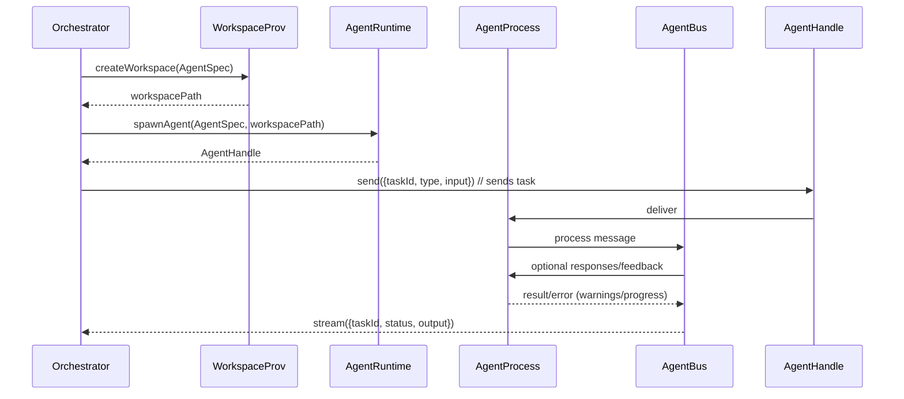
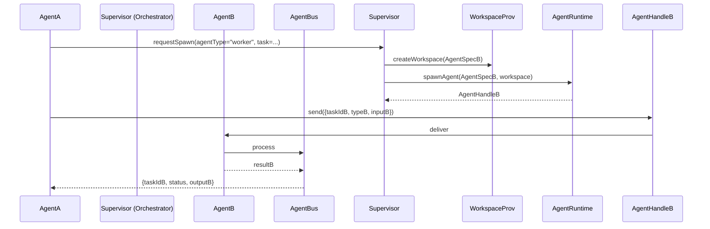
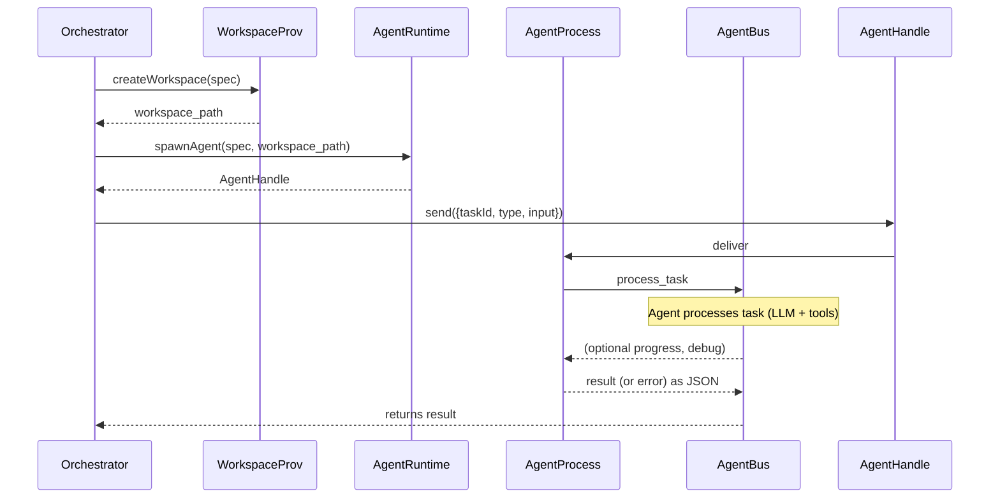
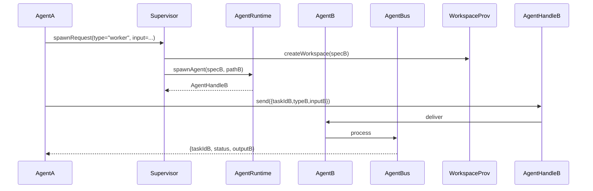

# Agent Orchestration Architecture (superstructure over **pi-agent-core**)

## Executive Summary

The presented architecture assumes **multi-layered separation** of responsibilities: a supervising orchestrator agent manages the lifecycle and communication with multiple subagents. Each subagent has its own **specification** (`AgentSpec`), working environment (`Workspace`) and execution instance (`AgentRuntime`), and delivers results in the form of **structured artifacts** (e.g., code patch, report, test results). Communication occurs through a unified message bus with explicit correlation IDs, and all tasks, progress, and results are defined via **schemas** (e.g., JSON Schema). Additionally, we ensure **observability** (via `tmux` panels or UI, logs, metrics, OTEL tracing) and **environment isolation** (worktrees, containers, etc.) for safety.

## Key Architectural Concepts

The architecture can be reduced to a few abstractions:

- **`AgentSpec`** – a declarative agent specification containing its role, system prompt, tool set, model, workspace, etc. (e.g., YAML with fields `name`, `description`, `tools`, `model`).
- **`WorkspaceProvider`** – a factory for working environments (separate working directories) for each agent. This can be the current repository, a Git worktree, a full clone, a temporary directory, etc. Each implementation offers a different degree of isolation and cost (see table below).
- **`AgentRuntime`** – the mechanism for launching an agent. Examples: local process (e.g., `spawn('pi')`), `tmux` session, Docker container, remote instance (SSH, Kubernetes). It should provide an interface for sending/stopping the agent process.
- **`AgentHandle`** – a handle to an active agent (the "client" in code), allowing messages to be sent and results received. Note: the `tmux` pane is only a visual interface adapter, not a communication channel – all exchange happens through the bus.
- **Communication Bus (`AgentBus`)** – an abstract channel: supports asynchronous _send_ messages, _request_ calls, and _stream_ responses. Each message carries a unique correlation ID (e.g., `requestId`), allowing the orchestrator to match results to tasks. Reliability improvements via timeouts and optional retries are the bus implementation's responsibility.

These components form a flexible foundation: concrete logic (e.g., **pi-coding-agent**) is built on top, but the bus itself and the flow are application-agnostic. This makes it possible to test different runtimes or workspace stores without changing the orchestrator logic.

## Message Schemas and Validation

All important messages are defined as schemas (e.g., **JSON Schema** or Protobuf). This enables static validation of inputs and outputs: as shown in the literature, schemas drastically reduce generative model errors.

Example JSON schemas:

```json
// Example task schema (request) for an agent
{
  "type": "object",
  "properties": {
    "taskId": { "type": "string" }, // task UUID
    "agent": { "type": "string" }, // target agent name/type
    "type": { "type": "string" }, // e.g. "analysis", "test", "review"
    "input": {
      // task-specific data
      "type": "object",
      "properties": {
        "query": { "type": "string" }
      },
      "required": ["query"],
      "additionalProperties": false
    }
  },
  "required": ["taskId", "agent", "type", "input"],
  "additionalProperties": false
}
```

```json
// Message schema for result or error
{
  "type": "object",
  "properties": {
    "taskId": { "type": "string" },
    "agent": { "type": "string" },
    "status": { "enum": ["completed", "failed"] },
    "output": {
      "type": "object",
      "properties": {
        "artifactType": { "type": "string" },
        "data": {} // structure depends on artifactType (see below)
      },
      "required": ["artifactType", "data"]
    },
    "error": {
      "type": "object",
      "properties": {
        "code": { "type": "string" },
        "message": { "type": "string" }
      },
      "required": ["code", "message"]
    }
  },
  "required": ["taskId", "agent", "status"]
}
```

Validation can be done with JSON Schema (e.g., the `ajv` library), Protobuf (with dedicated serialization), or language type systems (TypeScript + TypeBox, Python + Pydantic, etc.). The key principle: _strictly define_ required fields and types so that the model and subagent never exceed format boundaries.

Example YAML message (task request):

```yaml
taskId: "a1b2c3d4"
agent: "researcher"
type: "codeReview"
input:
  repository: "https://github.com/example/proj"
  issueId: 42
```

## Agent Spawn Flow

The sequence diagram shows the process of spawning an agent and returning a result:



1. **AgentSpec**: Based on the request, the orchestrator creates an agent specification (id, role, prompt, tools, workspace).
2. **WorkspaceProvider**: Allocates an isolated working directory (e.g., Git worktree, full clone, or tmp folder) according to the Spec configuration.
3. **AgentRuntime**: Launches the agent – e.g., starts a new `pi` process with the specified directory, role, and prompt. Returns a handle (`AgentHandle`) for communication. In `pi-coding-agent`, such a handle is a child process, optionally with a `tmux` pane.
4. **Communication**: The orchestrator sends a task request to the AgentHandle as serialized JSON. The agent (subagent) receives it, executes its agent-core loop, uses tools, etc. If issues arise, it publishes progress or errors.
5. **Result**: Upon completion, the subagent returns a JSON structure containing the `taskId` and artifact/message. Since the example implementation uses JSON mode (`pi --mode json`), we get structured output.

Delegation works similarly: if a subagent itself needs to create further "sub-subagents" (e.g., a planner delegates execution), it creates its own `AgentSpec` and uses a local AgentBus or communicates again via the supervisor. The delegation scenario is shown in the next diagram:



Here AgentA "asks" the Supervisor to start AgentB and sends it a task. AgentBus ensures the result (or error) reaches AgentA (with the appropriate `taskId`).

## Communication and Bus API

The communication bus is the core of the orchestrator. We propose a model similar to the _message bus_ pattern:

- **`send(dest, message)`** – direct asynchronous fire-and-forget. No response expected (useful for events).
- **`request(dest, request)`** – send a request expecting a response. The request contains a unique `requestId`, and the response (eventually) returns to the sender with the same `requestId`. This enables _request/reply_ with correlation.
- **`stream(dest, message)`** – stream of multiple messages (e.g., work progress, successive parts of a large result). The sender can mark the end of the stream (EOF) or use `status: completed/failed`.

All messages are in JSON format with meta fields (source, dest, requestId) and business data. We set timeouts (e.g., abort after a few seconds, optionally retry). Retries only make sense for idempotent tasks or agent-controlled flows (can fall back to the supervisor queue and retry). The convention could follow e.g., **JSON-RPC 2.0** (where `id` correlates request with response) or a custom lightweight protocol.

Message schemas:

```yaml
# Example TaskRequest
{
  "messageType": "TaskRequest",
  "payload": { ...validated input matching AgentSpec... },
  "requestId": "uuid-1234",
  "replyTo": "Orchestrator",
}
```

```yaml
# Example TaskProgress update
{
  "messageType": "TaskProgress",
  "requestId": "uuid-1234",
  "status": "running",
  "progress": { "percent": 0.5, "note": "Initializing tools" },
  "timestamp": "2026-06-21T12:00:00Z",
}
```

```yaml
# Example TaskResult completion
{
  "messageType": "TaskResult",
  "requestId": "uuid-1234",
  "status": "completed",
  "result":
    {
      "artifactType": "patch",
      "data":
        { "diff": "... normalized diff ...", "baseRevision": "abc123", "newRevision": "def456" },
    },
}
```

```yaml
# Example TaskError message
{
  "messageType": "TaskError",
  "requestId": "uuid-1234",
  "status": "failed",
  "error":
    { "code": "ToolCrash", "message": "Error during tool execution 'bash': resource not found" },
}
```

From the outside, each agent's results are only visible through these structures – we avoid a _black box_ of text. This allows the supervisor to further process these artifacts programmatically or report errors instantly.

## Artifacts (Results) and Their Formats

The output of an agent should not be a long text (as in a standard chat session), but rather a **structured artifact**:

- **Code Patch** – we can use e.g., the _unified diff_ format (text) or JSON Patch (RFC6902). Example: `artifactType: "patch"`, `data: {"diff": "...", "targetPath": "src/main.py"}`.
- **Report/Description** – e.g., Markdown or JSON with fields `title`, `summary`, `details`. Example: `artifactType: "report"`, `data: {"title":"Security Analysis","summary":"...", "reportMd": "..."}`.
- **Test Results** – a structure containing the test count, outcome, possibly JUnit/XML or JSON (`{"passed":10,"failed":2,"details":[...]}`). `artifactType: "testResults"`.
- **Other** – e.g., specific output files, binary data, or checkpoints. All depends on the tools. Format them consistently.

Key: clear contractualization. The agent should return normalized JSONs, even if the final textual form is Markdown (it can be treated as `detailsMarkdown`). This way orchestration always has a stable interface.

## Agent Lifecycle States

The supervising agent should track the state of each subagent. We can adopt the following states:

- **Spawned** – agent created (workspace prepared, process starting).
- **Running** – agent active, processing a task.
- **Waiting** – agent waiting for a task (e.g., from a queue or waiting for a sub-agent's result).
- **Completed** – finished the task successfully (result available).
- **Failed** – finished with an error (e.g., exception, timeout).

The supervisor records these changes (e.g., in the AgentHandle structure) and publishes events (e.g., `agent_spawned`, `agent_completed`, `agent_failed`). For parallel or chained tasks, statuses can be collected and aggregated to show e.g., "2/3 done, 1 in progress" in the UI, as in the extension example. The agent also processes control events (e.g., interrupts).

## Sequences and Diagrams

Below are simplified diagrams showing key scenarios:

**1. Spawning and full cycle:** the supervising orchestrator agent creates a spec, launches the agent, sends a task, and receives the result.



**2. Delegation (subagent):** agent A delegates part of the work to agent B and waits for the result.



These diagrams illustrate coordination through abstractions. Note that _tmux_ is only a visual option – in practice, AgentHandle communicates through the bus (AgentBus).

## Example JSON/YAML Formats

**Example request (JSON):**

```json
{
  "messageType": "TaskRequest",
  "payload": {
    "taskId": "abc-123",
    "type": "find-vulnerabilities",
    "input": {
      "files": ["src/main.py", "src/util.py"]
    }
  },
  "requestId": "req-001",
  "replyTo": "orchestrator"
}
```

**Example response (JSON):**

```json
{
  "messageType": "TaskResult",
  "payload": {
    "taskId": "abc-123",
    "status": "completed",
    "result": {
      "artifactType": "report",
      "data": {
        "summary": "Found 2 vulnerabilities",
        "reportMd": "- Problem on line 10\n- Missing error handling in X"
      }
    }
  },
  "requestId": "req-001"
}
```

## Recommended Transports and Their Pros/Cons

**Local IPC (pipes, UNIX socket):**

- _Pros:_ Very efficient, simple to implement with local processes (e.g., `spawn`).
- _Cons:_ Limited to the same machine and often a one-time connection. No flexibility for a distributed system.

**HTTP/REST:**

- _Pros:_ Simple and universal, many ready-made libraries, easy to firewall.
- _Cons:_ Header overhead and protocol overhead, each request/response is a separate connection (unless using HTTP keep-alive). Has latency (handshake). Good for communication between network services.

**WebSocket:**

- _Pros:_ Bidirectional channel, good support in browsers and servers. Allows pushing updates (progress, logs) in real time.
- _Cons:_ More complexity (connection maintenance, ping-pong). Not suitable for simple batch tasks without significant architectural overhead.

**Redis Pub/Sub / Streams:**

- _Pros:_ Lightweight broker, simple pub/sub. Enables distributed publish-subscribe (multiple instances subscribe to channels). Redis Streams allows for **persistent** message queues.
- _Cons:_ Redis Pub/Sub does not guarantee delivery or persistence. Easy to use but lacks advanced features (without Redis Streams). Requires a separate Redis service.

**NATS:**

- _Pros:_ High performance and lightweight, built-in pub/sub, request/reply, and queue patterns (JetStream). Sub-millisecond latency. Scalable in clusters. Official clients for many languages.
- _Cons:_ Requires running a NATS server. Not as widespread as HTTP. Relatively new ecosystem, but gaining popularity.

**gRPC / Protobuf:**

- _Pros:_ Fast serialization, stub support, simple request/reply methods with generated code.
- _Cons:_ JSON-less (binary), harder to debug, requires .proto definitions (less flexible schema-less approach). However, provides a solid contract.

The choice depends on scale. For a **local** "elbow-grease" solution, simply pipe/JSON or even `tmux` with stdin/stdout works best (Pi offers RPC mode over stdin/stdout). In a distributed system, NATS or HTTP is worth considering. Redis is fine for small events, but for critical queuing, consider JetStream or a dedicated broker.

## System Observability

A good design must have **full visibility** into agent operations. This includes:

- **`tmux` panels / UI:** each AgentHandle can be assigned to a separate `tmux` session or terminal panel, providing a _live view_ of logs and progress. This gives us a full real-time view of the agent's output stream (as in the Pi subagent example) – "full real-time observability." Such a "process → pane" map is maintained by the observability adapter, so internally messages still flow through the bus, and `tmux` is only a monitor.
- **Logs:** every event (agent start/stop, tool invocation, error) is recorded in logs (preferably structured JSON or OTLP). Can be aggregated to a central ELK/Loki, etc. Subprocesses can write stderr/stdout to files or forward them through the bus to the parent logger.
- **Metrics:** e.g., task count, agent execution time, token count, or tool call count. Can be measured manually or using an OTLP extension like [pi-otel].
- **Tracing (OpenTelemetry):** ideally – wrap every agent turn/invocation in a span. For example, `pi-otel` builds a trace tree: the root span is the interaction, subspans are successive LLM calls and tool invocations. This makes it possible to track where time is being spent (tool latencies, large prompts). Tool and model values are attached as span attributes.
- **Session ID and correlation:** efficiently match logs/metrics to agents via session identifiers and `taskId`. Combined with TMUX, each panel can be labeled with the agent name or taskId.

In practice: we add an _observability layer_ on top of `AgentRuntime`. For example, a `TmuxAdapter` reserves a new panel, sets the agent prompt, and connects the process STDOUT to the panel. In parallel, the agent publishes events to OTLP, and the supervising process reads and writes them to logs or APM tools. This approach maintains constant control over agents and makes it easy to diagnose problems (tools show errors just like results).

## Security and Isolation

By default, **Pi** operates without sandboxing – it has the current user's permissions. In practice, safety must be ensured:

- **Workspaces:** each agent gets an isolated repository/worktree. We can use **Git Worktrees** – fast (inherit repo state), low overhead, but _weak isolation_ (still the same .git). Alternatively, a full _clone_ of the repository to a temporary directory (higher I/O costs, but full file separation). Or a pipeline without a repo – a new directory with a copy of files.
- **Chroot / Containers:** the most secure option. Each agent runs in a separate chroot or Docker/POD container. In container mode, the entire Pi process and its tools execute in an isolated filesystem and network environment. Pi describes containerization patterns (micro-VM "Gondolin", plain Docker, OpenShell) for isolation.
- **Tool restrictions:** whitelists/blacklists can be introduced. For example, an analysis agent might only have access to `read`/`grep`, while `bash` or `network` are forbidden. Pi doesn't do this by default, but extensions can block calls.
- **System permissions:** the Pi user can be restricted to only the necessary directories (e.g., only `read` in the project directory, no sudo). In a container, it's easy to set up a non-sudo user.
- **ML model and sensitive data:** if using API keys, consider keeping them outside the sandbox (e.g., OpenShell allows masking keys via a gateway).

For example, Pi suggests the following approaches: keep the entire process in Docker for simplicity (FS isolation) or use "Gondolin" – a micro-VM for built-in tools. Such patterns minimize the risk of the agent deleting files outside its directory or sending data anywhere.

## MVP Implementation Plan and Milestones

Steps to a minimal deployment:

1. **Agent specification definition:** develop the `AgentSpec` format (e.g., YAML) with fields: `name`, `role`, `prompt`, `model`, `tools`, `workspaceType`. Make it easy to extend.
2. **WorkspaceProvider – prototype:** implement two types: "worktree" (git) and "clone" (copy repo). Test creation and cleanup.
3. **AgentRuntime – prototype:** local process: invoke `pi --mode rpc` with STDIN/STDOUT redirection. Returns a handle with input/output. Then extend with `tmux` option: _Tmux Adapter_ creates a new window/panel and directs the process to it.
4. **AgentBus – prototype:** simple JSONL-over-stdin/stdout (RPC) or a pub/sub library (e.g., Redis or ZeroMQ) for mediation. Initially may be synchronous (wait for result) or asynchronous _Promise_-based.
5. **Spawn/await API:** implement tools in the supervising agent (e.g., `!spawnAgent` and `!awaitAgent`) to launch and wait for the subagent's result.
6. **Schemas and validation:** prepare JSON Schema for typical tasks (examples: code analysis, tests). Integrate a validator.
7. **Delegation logic:** test a simple sequence: the main agent splits a task, waits for the subagent's outcome, and integrates the result.
8. **Observability:** connect stdout to panels / record logs. Add OTEL extensions (optional).
9. **Security:** choose an isolation strategy (e.g., first: `git worktree` + plain process; then Docker). Test that the process does not escape its directory.

Milestones:

- MVP1: Spawning agents with request/response communication (no UI).
- MVP2: Parallel tasks and delegations (with JSON result streaming).
- MVP3: Integration with tmux UI (separate windows).
- MVP4: Monitoring + isolation (Docker).

Each milestone includes integration tests: whether `AgentResult` reaches the orchestrator and is validated.

## Comparison of WorkspaceProvider and AgentRuntime Implementations

| **Implementation**     | **Complexity** | **Isolation**               | **Performance**             | **Observability**        |
| ---------------------- | -------------- | --------------------------- | --------------------------- | ------------------------ |
| **WorkspaceProvider:** |                |                             |                             |                          |
| – Current dir          | Low            | Low                         | High (no copying)           | Moderate (simple logs)   |
| – Git worktree         | Medium         | Low (shared .git)           | High (minimal overhead)     | Moderate                 |
| – Git clone            | Medium         | Medium–High (separate repo) | Low (copying)               | Moderate                 |
| – Tmp dir / zip        | Low–Medium     | Medium                      | Low (copying)               | Moderate                 |
| **AgentRuntime:**      |                |                             |                             |                          |
| – Local process        | Low            | Low                         | High                        | Moderate                 |
| – Tmux pane            | Low            | Low                         | High                        | High (interactive view)  |
| – Docker/container     | High           | High                        | Medium (container overhead) | Low (w/o add. tooling)   |
| – VM/Kubernetes        | Very high      | Very high                   | Low (high overhead)         | Low                      |
| – Remote (SSH/ws)      | High           | Depends on remote machine   | Low (network)               | Low (depends on channel) |

The table shows that the simplest configurations (worktree + process) offer high performance at the cost of isolation. If security is needed, Docker/VM provide greater separation but reduce speed and complicate visualization (beyond logs). `tmux` increases observability at minimal cost (adds UI).

## Sources and References

The above recommendations are based on **primary Pi sources** (documentation, example extensions) and industry standards. For example, Pi encourages the use of _JSON mode_ for structured data exchange. The Pi architecture from the code author indicates the principle of "spawn via bash/tmux for full visibility." Security-wise, sandboxing is missing by default – hence Pi suggests scenarios with Docker or OpenShell. Additionally, JSON Schema validation is strongly recommended by practitioners (e.g., Michael Lanham) as a quick fix for "flaky" model outputs. The various transport options are supported by network traffic analyses: Redis Pub/Sub provides simple, non-durable transmission, while NATS offers a lightweight and fast messaging infrastructure with request/reply and streaming.

With such an architecture, we gain a flexible system where the **supervisor** can launch and coordinate multiple agents in parallel, delegate tasks to them, and collect results in the form of concrete artifacts, while maintaining full control and environmental safety. All key decisions (agent models, schemas, runtimes, channels) remain easily configurable, and the solution scales from simple local scripts to distributed multi-machine systems.

**Sources:** Pi Agent Core and Pi Coding Agent documentation and examples, comparative articles, blogs and materials on telemetry, and technology documentation (JSON Schema, Redis, NATS). All cited fragments originate from these sources.
