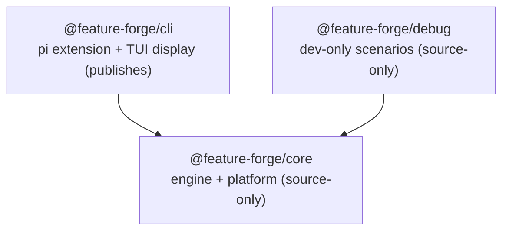

# ADR 0020: Package layering - core / cli / debug

**Date:** 2026-08-19
**Status:** Accepted (implemented by #229)

## Context

Issue #229 restructured the monorepo into a strict one-directional package
graph (`core <- cli <- debug`). Before it, two structural problems dominated
(issue section 1):

- **`packages/cli` was the whole system** (~12k LOC non-test): agents, flow
  engine, step executors, IPC, workspace, commands, tools, extensions, plus
  bundled content. `src/orchestrator/` mixed the flow engine (`FlowLoader`,
  `FlowStateStore`, `FlowInstruction`, `FlowRegistrar`,
  `ExpressionEvaluator`), the step executors, routine execution, the event
  bus, and the TUI-coupled `RoutineTool`. `src/agents/agents/` double-nested;
  `github.ts` sat at the package root.
- **The package graph was a cycle**: `@feature-forge/tui` deep-imported
  `TypedEventBus` and the IPC wire types from `cli/src/...` (undeclared
  dependency), while `cli` runtime-imported `tui` while listing it only in
  `devDependencies` (architecture-review §2.2, finding 3.1). Neither
  direction was declared, so the build graph was a lie: `tui` could never be
  built, published, or tested in isolation.

The consequence of the weld: nothing was reusable by a non-TUI front end
(e.g. the howcode desktop app), because engine mechanics and pi-TUI display
were coupled inside `cli`. The architecture review prescribed the split
(findings 3.1/3.2, roadmap section 6); issue #229 closed the design decisions
(D1-D9) in a planning session and executed the restructure in one PR.

ADR 0019's consequences reserved 0018 for these package-layering decisions
("S10's package-layering decisions (D1-D8)"); the reservation lapsed and no
0018 was ever written, so 0020 was chosen as the next free number after
0019 (the S4c seam ADR). ADR 0019 covers the flow-engine seam; this ADR
records the layering decisions themselves.

## Decision

- **D1 - fold `tui` into `cli`.** The pi-TUI display code is the cli
  package's domain; a desktop front end gets its own display layer. Folding
  kills the `tui -> cli` cycle naturally (same concept, two names; no other
  consumer of the pi-TUI widgets existed).
- **D2 - the engine package is named `core`** (`@feature-forge/core`, source
  package at `packages/core/`).
- **D3 - keep `@feature-forge/cli` as the extension package name.** The
  published pi extension keeps its identity and `bin/forge` entry.
- **D4 - `core` depends on pi agent SDKs only, never `pi-tui`.**
  `@earendil-works/pi-agent-core`, `@earendil-works/pi-ai`, and
  `@earendil-works/pi-coding-agent` are peer dependencies; the
  `@earendil-works/pi-tui` import is forbidden in core (to be lint-enforced
  in S11, see below). howcode embeds pi, so the agent-SDK coupling is
  correct; only
  rendering must stay out.
- **D5 - superseded by D9.** The roadmap 3.1 deviation question (wire types +
  `TypedEventBus` in core, not shared) is moot once `shared` merges into
  `core` - they are core concerns by construction.
- **D6 - DisplayProjection (roadmap 2a) is pulled into the restructure.**
  Executors lose all display methods; the pure projection fold and state
  (`DisplayProjection.applyEvent`, `AccumulatedState`) live in
  `cli/src/tui/progress`. The restructure lands the 2a end state; review and
  restructure each make the other cheaper.
- **D7 - one PR** with move commits first, the 2a projection commit as the
  final logic commit group (script moves + surgery land after).
- **D8 - superseded by D9.** The `shared/src/tools/Tool.ts` type-only
  `pi-coding-agent` import question disappears - core already has the pi
  peerDependencies.
- **D9 - `shared` merges into `core`.** Config, logging, `Registry`,
  helpers, and the tool bases land in core with the same directory names;
  `AgentStatus` joins `core/agents/`. Both layers imported it, cli already
  depends on core, and no leaf consumer existed - a separate package bought
  nothing.

### Target graph and consumption model



- `core` - engine mechanics + platform utils: agents, flows, executors,
  routines, event-bus, ipc, workspace, progress contracts, config, logging,
  helpers, tool bases, skills content, flow definitions, and the command +
  registry layers (`src/commands/`: `Command`, `OrchestratorCommand`,
  `Worktree*`, `AgentDestroy*`, `ResearchCommand`; `src/registry/`:
  `CommandRegistry`, `ToolRegistry`, `withForgePrefix` - moved from cli in
  the rework). No pi-tui imports; no `@feature-forge/cli` imports anywhere
  (tests included - the last cli tool-class fixtures were replaced with local
  stubs, see Consequences).
- `cli` - the composition root (`index.ts`), the pi-extension commands and
  tools that stay cli-owned (`AgentList`, `FlowExit`, `ForgeInit`; the tool
  classes incl. `RoutineTool`), extensions, and the folded TUI display.
  Builds with tsup and publishes (pi extension field + `bin/forge`).
- `debug` - dev-only test scenarios and commands; accepts cli-shaped
  components via dependency interfaces so it never imports cli directly.

Consumption model matches prior practice: only `cli` builds with tsup and
publishes; `core` and `debug` are consumed as source via
`main: ./src/index.ts` through the npm workspace.

### Seams

The flow engine lives in core; the command layer moved into core with the
rework, so only the routine-tool seam remains. `RoutineTool` stays cli-owned
(it renders with pi-tui, D4): one factory type on `FlowRegistrarContext`

- `CreateRoutineTool` - is wired at the cli composition root
  (`packages/cli/src/index.ts`) as `(…) => new RoutineTool(…)`.
  `OrchestratorCommand` and the registries moved to core, so no structural
  `*Like` surface, no `CreateOrchestratorCommand` factory, and no `as never`
  cast survive (ADR 0019's command seam is dissolved - see its Superseded
  section). `WorkspaceHandle` moved early: it is a zero-import value object
  whose move kept a runtime core -> cli edge from ever landing. Full detail in
  ADR 0019.

### DisplayProjection end state

Zero display vocabulary in core: no executor implements display methods, and
core holds no event-to-display mapping. The projection lives in
`cli/src/tui/progress` (pure `applyEvent(state, event)` fold over
`event.phase`); `RoutineTool` subscribes once and folds; `ProgressRenderer`
reads the accumulated state. This is architecture-review 3.2's prescription,
landed as the implementation.

### Layering enforcement

`no-restricted-imports` rules landed with the rework (`packages/core` and
`packages/debug` `eslint.config.js`), making the graph a compile-time
contract:

- `core` forbids `@feature-forge/cli` and `@earendil-works/pi-tui` (src and
  scripts).
- `cli` is unrestricted (top of the stack).
- `debug` forbids `@feature-forge/cli` (keeps the DI boundary).

The rule applies to all core files, test files included: the last cli
tool-class fixtures in tests (`RoutineTool` x2, `SetSessionNameTool`) were
replaced with local stubs in the cleanup round, so no exemption remains.

## Consequences

- The published `dist/` layout is preserved: tsup copies flows, skills,
  declarative specs, and scripts from core into `cli/dist/` (`onSuccess` in
  `packages/cli/tsup.config.ts`), so `forge:init` scaffolding and the
  `flow:*` npm scripts behave exactly as before.
- `packages/shared` and `packages/tui` are deleted; any external consumer of
  `@feature-forge/shared` (none existed) or the tui package must switch to
  core/cli paths.
- The 3.1 cycle is gone by construction (D5/D9): wire types and
  `TypedEventBus` live in core, `shared` no longer exists, and the
  `tui -> cli` deep imports are gone with the fold. Roadmap Phase 1a becomes
  a verification pass, not a move.
- Roadmap 2a is consumed by this restructure (D6); roadmap Phase 2 shrinks to
  the `RoutineTool` split (2b), which now operates on the new layout.
- Roadmap 3a/3b (config de-singleton, logger simplification) operate inside
  `core/src/config` and `core/src/logging`.
- The shared-barrel runtime crash (architecture-review 3.22) self-heals: the
  `export { ... }` type/value split problem disappears with the merge into
  core, and `flow:validate` runs from `core/scripts`.
- Core tests import no cli code: the last three cli tool-class fixtures
  (`RoutineTool` x2, `SetSessionNameTool`) were replaced with local stubs in
  the cleanup round, and the no-restricted-imports rule applies to all core
  files including tests. No `core -> cli` edge remains anywhere in the
  package.

## Amendment (rework)

Issued with the #229 rework (R-S1..R-S3); the layering decisions D1-D9 are
unchanged. Corrected in this ADR:

- The command/registry layer classification: `commands/` (`Command`,
  `OrchestratorCommand`, `Worktree*`, `AgentDestroy*`, `ResearchCommand`) and
  `registry/` (`CommandRegistry`, `ToolRegistry`, `withForgePrefix`) live in
  core, not cli (R-S1/R-S2). The cli bullet above therefore lists only the
  commands/tools that remain cli-owned (`AgentList`, `FlowExit`, `ForgeInit`,
  the tool classes incl. `RoutineTool`).
- The seam story: only `createRoutineTool` remains (RoutineTool stays cli,
  D4); the `*Like` surfaces, `CreateOrchestratorCommand`, and the `as never`
  cast are dissolved (see ADR 0019's Superseded section).
- Test-utils moved to core (R-S3); the rules themselves have landed. The
  cleanup round replaced the last cli tool-class fixtures in core tests with
  local stubs, removing the test-file exemption entirely.

## Amendment (exports map, E1/E2)

Issued with the #229 rework round 2 (E1/E2); the layering decisions D1-D9 and
the R-S1..R-S3 corrections above are unchanged. `packages/core/package.json`
gained an explicit `exports` map, and the previous
`@feature-forge/core/src/<dir>` deep-import style is **superseded**.

### Consumption model

Core exposes two import surfaces, neither of which contains `/src/`:

- `@feature-forge/core` - the root barrel (`src/index.ts`) re-exports the
  full public API across every public directory (test-utils excluded - it is
  test-support, not public API).
- `@feature-forge/core/<dir>` - explicit subpaths for `agents`, `commands`,
  `config`, `event-bus`, `executors`, `flows`, `github`, `helpers`, `ipc`,
  `logging`, `progress`, `registry`, `routines`, `tools`, `workspace`, plus
  `test-utils` for test-only helpers (cross-package consumers only).
  `RpcClientMock` and `createRpcClientMock` live in `test-utils` and are
  deliberately NOT re-exported from the root barrel. The map also exports
  `./package.json` (consumed by `forge-setup.js` via `require.resolve`) -
  18 keys total: root + 15 dirs + test-utils + package.json.

```ts
import { ForgeConfig } from "@feature-forge/core";
import { WorkspaceHandle } from "@feature-forge/core/workspace";
// cross-package only: cli's src/test-utils.ts re-exports this shim
import { makeMockPi } from "@feature-forge/core/test-utils";
```

### Exports map mechanics

- Every key is explicit; there is **no catch-all** (`./*`) condition. A new
  public symbol or directory must be added as an `exports` key - the map is
  the public API surface and grows by open-closed principle, never by
  accident.
- Each subpath lists the `types` condition before `default`, both pointing
  at `.ts` source (core stays source-only). The `types`-first ordering keeps
  tsc on the type resolution path.
- The lack of a catch-all is what eliminates `/src/` deep imports: an import
  of `@feature-forge/core/src/<dir>/<file>` fails resolution outright, so no
  internal path can leak into the public surface.

### Internal rule

Core-internal cross-directory imports are **relative**, never the root
barrel: `src/index.ts` re-exports every public directory, so importing the
barrel from inside core would create an evaluation-time cycle. The
internal-relative rule applies to test files too - since the #229 cleanup
sweep, every core test file imports helpers via relative paths, never the
subpath (top-level tests use `../test-utils`, nested dirs
`../../test-utils`). The `@feature-forge/core/test-utils` public subpath
exists for cross-package consumers only; today its sole consumer is the
`packages/cli/src/test-utils.ts` re-export shim. The one deliberate
self-package subpath import left in core tests is the `Tool` base class
from `@feature-forge/core/tools` in the three local-stub files - the
stubs extend the exported base, and a subpath import never touches the
root barrel, so no evaluation cycle is created.

### cli / debug

`cli` and `debug` have no exports map. `cli` is consumed built
(`main: dist/index.js`, published via tsup), so `@feature-forge/cli/...`
subpath imports fall back to legacy deep resolution; `debug` is source-only
with `main: ./src/index.ts` and no subpaths (cli's `registerTestCommands`
imports the `@feature-forge/debug` root).
