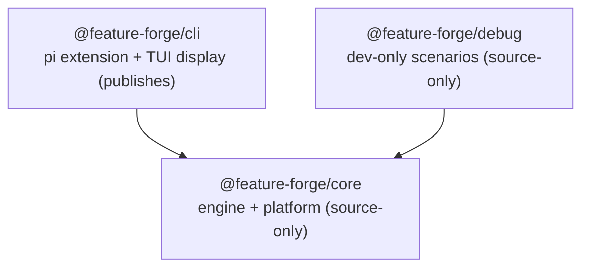

# ADR 0020: Package layering - core / cli / debug

**Date:** 2026-08-19
**Status:** Accepted (implemented by #229)

## Context

Issue #229 restructured the monorepo into a strict one-directional package
graph (`core <- cli <- debug`). Before it, two structural problems dominated
(issue section 1):

- **`packages/cli` was the whole system** (~12k LOC non-test): agents, flow
  engine, step executors, IPC, workspace, commands, tools, extensions, plus
  bundled content. `src/orchestrator/` mixed the flow engine (`FlowLoader`,
  `FlowStateStore`, `FlowInstruction`, `FlowRegistrar`,
  `ExpressionEvaluator`), the step executors, routine execution, the event
  bus, and the TUI-coupled `RoutineTool`. `src/agents/agents/` double-nested;
  `github.ts` sat at the package root.
- **The package graph was a cycle**: `@feature-forge/tui` deep-imported
  `TypedEventBus` and the IPC wire types from `cli/src/...` (undeclared
  dependency), while `cli` runtime-imported `tui` while listing it only in
  `devDependencies` (architecture-review §2.2, finding 3.1). Neither
  direction was declared, so the build graph was a lie: `tui` could never be
  built, published, or tested in isolation.

The consequence of the weld: nothing was reusable by a non-TUI front end
(e.g. the howcode desktop app), because engine mechanics and pi-TUI display
were coupled inside `cli`. The architecture review prescribed the split
(findings 3.1/3.2, roadmap section 6); issue #229 closed the design decisions
(D1-D9) in a planning session and executed the restructure in one PR.

ADR 0019's consequences reserved 0018 for these package-layering decisions
("S10's package-layering decisions (D1-D8)"); the reservation lapsed and no
0018 was ever written, so 0020 was chosen as the next free number after
0019 (the S4c seam ADR). ADR 0019 covers the flow-engine seam; this ADR
records the layering decisions themselves.

## Decision

- **D1 - fold `tui` into `cli`.** The pi-TUI display code is the cli
  package's domain; a desktop front end gets its own display layer. Folding
  kills the `tui -> cli` cycle naturally (same concept, two names; no other
  consumer of the pi-TUI widgets existed).
- **D2 - the engine package is named `core`** (`@feature-forge/core`, source
  package at `packages/core/`).
- **D3 - keep `@feature-forge/cli` as the extension package name.** The
  published pi extension keeps its identity and `bin/forge` entry.
- **D4 - `core` depends on pi agent SDKs only, never `pi-tui`.**
  `@earendil-works/pi-agent-core`, `@earendil-works/pi-ai`, and
  `@earendil-works/pi-coding-agent` are peer dependencies; the
  `@earendil-works/pi-tui` import is forbidden in core (to be lint-enforced
  in S11, see below). howcode embeds pi, so the agent-SDK coupling is
  correct; only
  rendering must stay out.
- **D5 - superseded by D9.** The roadmap 3.1 deviation question (wire types +
  `TypedEventBus` in core, not shared) is moot once `shared` merges into
  `core` - they are core concerns by construction.
- **D6 - DisplayProjection (roadmap 2a) is pulled into the restructure.**
  Executors lose all display methods; the pure projection fold and state
  (`DisplayProjection.applyEvent`, `AccumulatedState`) live in
  `cli/src/tui/progress`. The restructure lands the 2a end state; review and
  restructure each make the other cheaper.
- **D7 - one PR** with move commits first, the 2a projection commit as the
  final logic commit group (script moves + surgery land after).
- **D8 - superseded by D9.** The `shared/src/tools/Tool.ts` type-only
  `pi-coding-agent` import question disappears - core already has the pi
  peerDependencies.
- **D9 - `shared` merges into `core`.** Config, logging, `Registry`,
  helpers, and the tool bases land in core with the same directory names;
  `AgentStatus` joins `core/agents/`. Both layers imported it, cli already
  depends on core, and no leaf consumer existed - a separate package bought
  nothing.

### Target graph and consumption model

- `core` - engine mechanics + platform utils: agents, flows, executors,
  routines, event-bus, ipc, workspace, progress contracts, config, logging,
  registry, helpers, tool bases, skills content, flow definitions. No pi-tui
  imports; no production `@feature-forge/cli` imports (test files use cli
  test-utils - see Consequences).
- `cli` - the composition root (`index.ts`), commands, tools, extensions,
  registry, and the folded TUI display. Builds with tsup and publishes (pi
  extension field + `bin/forge`).
- `debug` - dev-only test scenarios and commands; accepts cli-shaped
  components via dependency interfaces so it never imports cli directly.

Consumption model matches prior practice: only `cli` builds with tsup and
publishes; `core` and `debug` are consumed as source via
`main: ./src/index.ts` through the npm workspace.

### Seams

The flow engine lives in core but depends on cli-owned concretions
(`RoutineTool`, `OrchestratorCommand`). Two factory types on
`FlowRegistrarContext` - `CreateRoutineTool` and `CreateOrchestratorCommand`
\- are wired at the cli composition root (`packages/cli/src/index.ts`):
`(…) => new RoutineTool(…)` and `(deps) => new OrchestratorCommand(deps)`.
Core types cli-owned collaborators structurally by the members actually
consumed (`CommandRegistryLike`, `ToolRegistryLike`, `WorkspaceManagerLike`),
and the single documented `as never` cast at the composition root bridges
core's structural deps and cli's concrete command deps. `WorkspaceHandle`
moved early: it is a zero-import value object whose move kept a runtime
core -> cli edge from ever landing. Full detail in ADR 0019.

### DisplayProjection end state

Zero display vocabulary in core: no executor implements display methods, and
core holds no event-to-display mapping. The projection lives in
`cli/src/tui/progress` (pure `applyEvent(state, event)` fold over
`event.phase`); `RoutineTool` subscribes once and folds; `ProgressRenderer`
reads the accumulated state. This is architecture-review 3.2's prescription,
landed as the implementation.

### Layering enforcement

`no-restricted-imports` rules will land in batch S11 of this series (issue
section 8; not yet present) to make the graph a compile-time contract:

- `core` forbids `@feature-forge/cli` and `@earendil-works/pi-tui`.
- `cli` is unrestricted (top of the stack).
- `debug` forbids `@feature-forge/cli` (keeps the DI boundary).

The rules will exempt test files: core's unit tests import cli's test-utils
at runtime until those move to core (S11). Test-only imports never ship, and
the exemption is the documented bridge that keeps the production direction
enforced without blocking the suite once the rules land.

## Consequences

- The published `dist/` layout is preserved: tsup copies flows, skills,
  declarative specs, and scripts from core into `cli/dist/` (`onSuccess` in
  `packages/cli/tsup.config.ts`), so `forge:init` scaffolding and the
  `flow:*` npm scripts behave exactly as before.
- `packages/shared` and `packages/tui` are deleted; any external consumer of
  `@feature-forge/shared` (none existed) or the tui package must switch to
  core/cli paths.
- The 3.1 cycle is gone by construction (D5/D9): wire types and
  `TypedEventBus` live in core, `shared` no longer exists, and the
  `tui -> cli` deep imports are gone with the fold. Roadmap Phase 1a becomes
  a verification pass, not a move.
- Roadmap 2a is consumed by this restructure (D6); roadmap Phase 2 shrinks to
  the `RoutineTool` split (2b), which now operates on the new layout.
- Roadmap 3a/3b (config de-singleton, logger simplification) operate inside
  `core/src/config` and `core/src/logging`.
- The shared-barrel runtime crash (architecture-review 3.22) self-heals: the
  `export { ... }` type/value split problem disappears with the merge into
  core, and `flow:validate` runs from `core/scripts`.
- Core's remaining test-only cli imports (31 files) are the last runtime
  `core -> cli` edges; they self-heal when cli's test-utils move to core
  (S11) and are exempted from the restricted-imports rules until then.
