# Feature Forge - Architecture Review & Refactoring Proposal

**Date:** 2026-08-17
**Verified against:** `main` @ `4f2a11a` (2026-08-17) - see §10 Verification Report
**Scope:** Full monorepo (`packages/cli`, `packages/shared`, `packages/tui`, `packages/debug`, `packages/eslint-config`, `packages/web`), ~58k lines of TypeScript
**Method:** First-pass deep read of all 150+ production source files, then four parallel read-only audit agents (tui, cli, shared, test architecture), cross-package import analysis, and targeted runtime probes. Every finding is cited with file evidence; the dramatic ones were independently re-verified by the orchestrator.
**Baseline health:** `npm run typecheck` passes (10/10 tasks); 2,172 tests pass; **`npm test -- --coverage` currently FAILS the 90% branch threshold (88.53%)** - see 3.23. This review is about _structure_, not compilation.

---

## 1. Executive Summary

The codebase is well-tested, thoughtfully documented (15 ADRs), and mostly consistent in style. The agent hierarchy, the deterministic orchestrator, and the IPC transport are genuinely well-designed pieces. However, the system has accumulated **structural problems** that now cost more than they save:

1. **A circular package dependency** - `@feature-forge/tui` deep-imports from `@feature-forge/cli/src/...` (undeclared), and `cli` runtime-imports `tui` while listing it only in `devDependencies`. Neither direction of the cycle is declared.
2. **Presentation logic welded into the execution engine** - every `StepExecutor` carries dual display mechanisms (`getDisplayContribution` + `registerDisplayHandler`), making the deterministic engine depend on TUI vocabularies.
3. **A pervasive service-locator singleton (`ForgeConfig`)** reaching into ~15 production files, from agent transport to TUI state. Tests pay the tax three times (three `test-setup.ts` copies exist solely to boot the singleton; two are byte-identical, the third differs only by import path).
4. **Systematic duplication** - template resolution implemented 4 times, tool execution skeleton copy-pasted 6 times, tool-activation logic duplicated between session and subprocess paths.
5. **Verified runtime bugs** - `import('@feature-forge/shared')` crashes under tsx (breaking `flow:validate`), `resolveModel` leaks prototype-chain properties, `/flow:exit` followed by re-mount permanently leaks the orchestrator persona, and the implement loop feeds the builder routine-ref envelopes instead of review findings (defeating self-correction).
6. **The coverage gate fails today** - 2,172 tests pass but `npm test -- --coverage` exits 1 (branches 88.53% vs 90%), which breaks the repo's own Deterministic Gate.

All of these are fixable without changing user-facing behavior. The proposed refactoring is phased so each step lands independently; the test-architecture audit (section 7) quantifies the blast radius per phase.

---

## 2. Current Architecture

### 2.1 Package dependency graph (as declared)

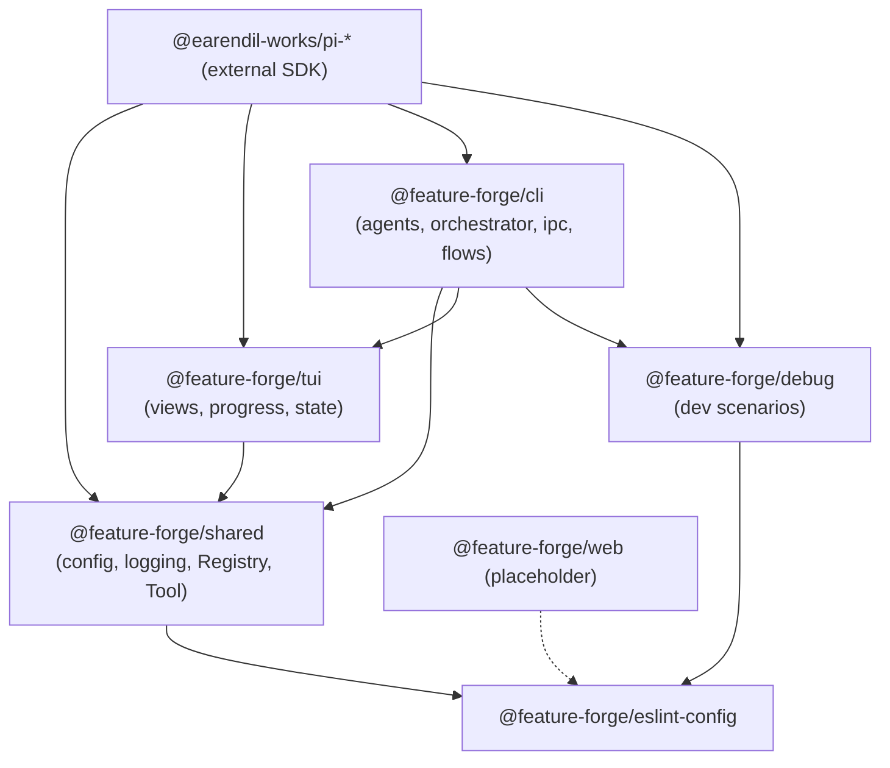

### 2.2 Dependency graph (as actually imported)

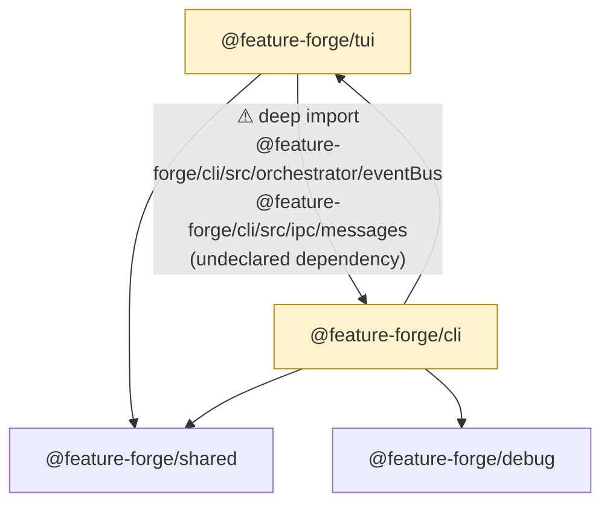

**Evidence:**

- `packages/tui/src/views/AgentViewerOverlay.ts:5` - `import { TypedEventBus } from "@feature-forge/cli/src/orchestrator/eventBus"` (a **value** import, not `import type` - tsup can pull cli source into tui's module graph)
- `packages/tui/src/views/ToolRenderer.ts:8` - `import type { SendTaskParams, SpawnAgentParams } from "@feature-forge/cli/src/ipc/messages";`
- `packages/tui/package.json` does **not** declare `@feature-forge/cli` at all.
- The reverse edge is also undeclared: `cli` imports `@feature-forge/tui` at **runtime** (`RoutineTool.ts`, `showAgentViewer.ts`, `ListAgentsTool.ts`, all five agent tools) but lists it only in `devDependencies`.
- `packages/tui/src/api.ts` already defines an `EventSubscriber` interface precisely for this boundary - it is exported and **never used**.

This is the classic **layer inversion**: `tui` is supposed to be a leaf library consumed by `cli`, but it reaches into `cli`'s internals through a package-subpath that bypasses the package boundary. It works today only because workspaces symlink packages and the build (tsup) follows the source file. Consequences:

- `@feature-forge/tui` can never be built, published, or tested in isolation.
- Any refactor of `cli`'s event bus or IPC types ripples into `tui` silently.
- The monorepo's build graph is a lie: `tui`'s real input set includes `cli` sources.

### 2.3 Runtime layering (current)

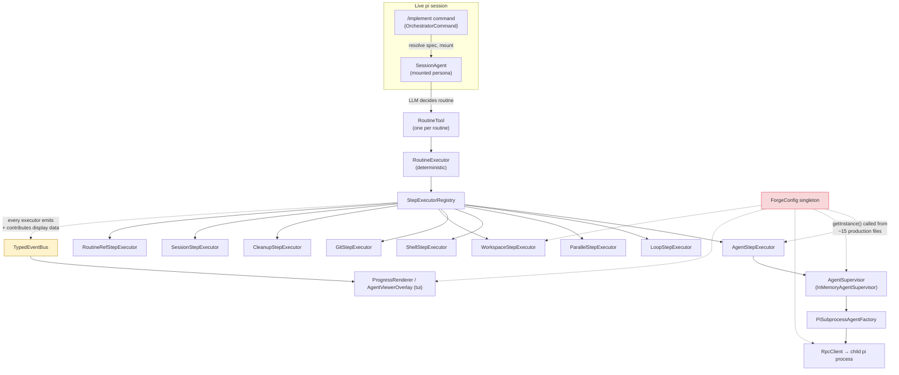

---

## 3. Findings

Each finding is rated **P0** (architecture violation), **P1** (duplication / design smell), **P2** (correctness risk), **P3** (hygiene). Effort is S (< 1 day), M (1-3 days), L (3+ days).

---

### 3.1 P0-1: Circular package dependency (`tui` → `cli` deep imports)

|            |                                                                                                                                 |
| ---------- | ------------------------------------------------------------------------------------------------------------------------------- |
| **Files**  | `packages/tui/src/views/AgentViewerOverlay.ts:5`, `packages/tui/src/views/ToolRenderer.ts:8`                                    |
| **Impact** | Breaks monorepo layering, makes `tui` untestable/unpublishable in isolation, silently couples `cli` internals to a leaf package |
| **Effort** | M                                                                                                                               |

**Why it happened:** `TypedEventBus` and the IPC message types are _generic infrastructure_ that were placed in `packages/cli` because that is where they were first needed. The `tui` package needs them for its API surface, so it reached across.

**Proposed fix - move shared contracts down, structural types up:**

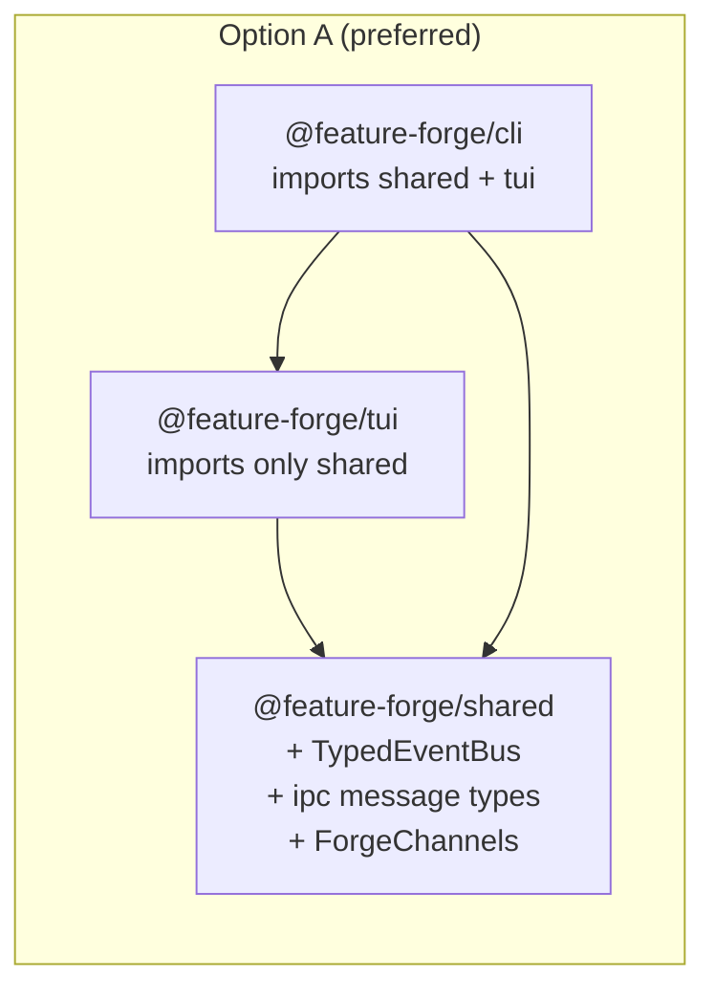

- Move `TypedEventBus`, `ForgeChannels`, and the wire types (`SocketMessage`, `SocketResponse`, `SocketPush`, `SpawnAgentParams`, `SendTaskParams`, result types) from `cli/src/orchestrator/eventBus` and `cli/src/ipc/messages` into `@feature-forge/shared`. They are pure types + a 20-line wrapper with no `cli`-specific logic.
- `tui` imports only `@feature-forge/shared` (already a declared dependency).
- `cli` re-exports from `shared` for backwards compatibility during migration.

**Option B (lighter):** declare minimal structural interfaces in `tui` (e.g. `EventBusLike<C>` with an `on()` signature) and make `TypedEventBus` implement them. This works but leaves two type families to reconcile, which is exactly the drift this repo has suffered elsewhere - prefer Option A.

> **Status: RESOLVED by #229 (package restructure).** The `tui -> cli` cycle is
> gone by construction: `packages/tui` was folded into `cli/src/tui` (D1), and
> the wire types + `TypedEventBus` now live in `@feature-forge/core` because
> `@feature-forge/shared` merged into core (D5/D9). No code move was needed
> beyond the restructure itself; roadmap Phase 1a (p1a) is consumed. See
> ADR 0020.

---

### 3.2 P0-2: Display pipeline welded into the execution engine

|            |                                                                                                                                                                                                                                                                                           |
| ---------- | ----------------------------------------------------------------------------------------------------------------------------------------------------------------------------------------------------------------------------------------------------------------------------------------- |
| **Files**  | `StepExecutor.ts` (abstract methods), 7 of 9 step executors (`AgentStepExecutor`, `LoopStepExecutor`, `WorkspaceStepExecutor`, `CleanupStepExecutor`, `ShellStepExecutor`, `SessionStepExecutor`, `RoutineRefStepExecutor`, plus `ProgressRenderer`/`DisplayContributionRegistry` in tui) |
| **Impact** | SRP violation - the deterministic engine depends on display vocabularies; every new executor must implement two display methods; the widget pipeline iterates _all_ executors for _every_ progress event                                                                                  |
| **Effort** | L                                                                                                                                                                                                                                                                                         |

**How it works today** (the dual push/pull mechanism):

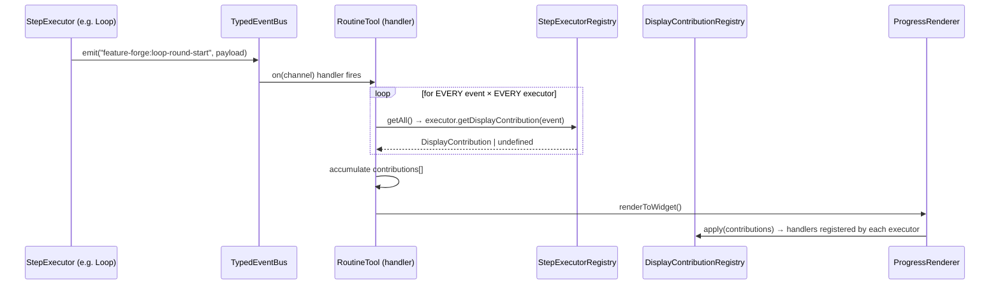

Problems:

1. **Two parallel mechanisms for one job.** Each executor implements both `getDisplayContribution()` (pull - parses event phases) and `registerDisplayHandler()` (push - mutates `AccumulatedState`). The `type` strings in contributions must match the strings registered by handlers, enforced nowhere at compile time.
2. **O(n × m) per event.** `RoutineTool`'s handler iterates every executor in the registry for every event that arrives (see `RoutineTool.ts`, the `handler` closure). With 10 executors and thousands of `agent-stream` events, that is thousands of wasted dispatches - mitigated only by the `streamEvent` skip check.
3. **The engine knows display vocabulary.** `AgentStepExecutor` maps `agent-started` → `"started"` etc. (`getDisplayContribution`, lines ~240-270). Change a TUI chip and you edit the executor.
4. **Stringly-typed phases.** `event.phase.startsWith("loop-")` in `LoopStepExecutor` - phase names are the real type discriminator, the `ForgeChannels` map is advisory.

**Proposed fix - events only, projection in one place:**

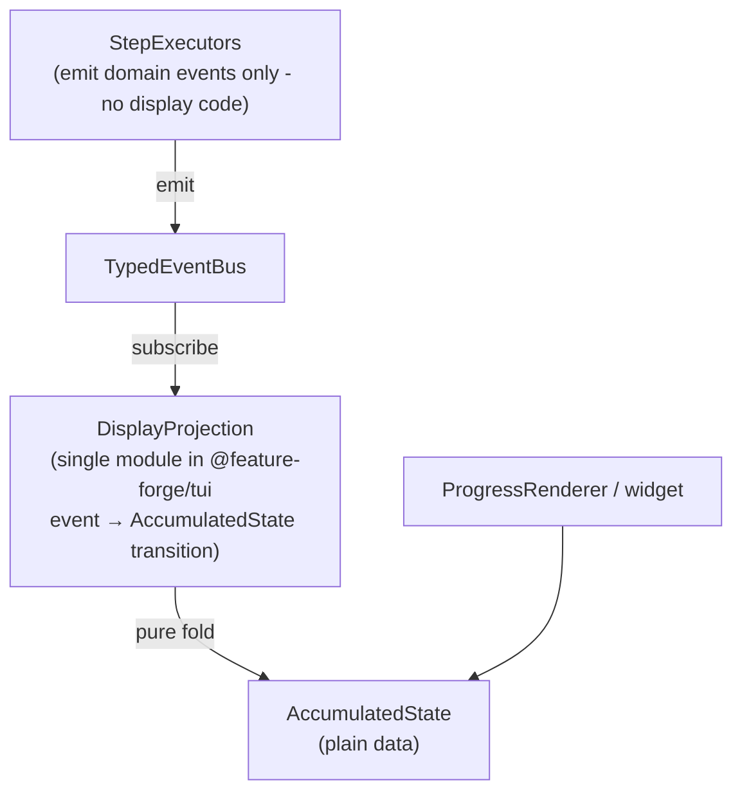

- Delete `getDisplayContribution` and `registerDisplayHandler` from `StepExecutor` and every executor. Executors keep their `eventBus.emit(...)` calls (which are already domain-level).
- Add **one** pure projection module in `tui`: `applyEvent(state, event): AccumulatedState` - a single switch over `event.phase`. This is the only place that knows how an event renders.
- `RoutineTool` subscribes once and calls `applyEvent`; `ProgressRenderer` reads the folded state.
- Result: engine → TUI dependency removed, O(1) per event, one place to change display behavior, trivially unit-testable projection.

> **Status: LANDED as part of #229 (roadmap 2a, D6).** The prescription became
> the implementation: `getDisplayContribution`/`registerDisplayHandler` were
> deleted from `StepExecutor` and the executors, and the projection now lives
> in `cli/src/tui/progress/DisplayProjection.ts` (`applyEvent` fold +
> `AccumulatedState`). Core contains zero display vocabulary. Roadmap Phase 2
> (p2a) is consumed; the remaining RoutineTool split is roadmap 2b. See
> ADR 0020.

---

### 3.3 P0-3: `ForgeConfig` service-locator singleton

|            |                                                                                                                                                                                                                                                                                                                                       |
| ---------- | ------------------------------------------------------------------------------------------------------------------------------------------------------------------------------------------------------------------------------------------------------------------------------------------------------------------------------------- |
| **Files**  | `shared/src/config/ForgeConfig.ts` + ~15 consumers, incl. `cli/src/agents/agents/PiSubprocessAgent.ts`, `cli/src/ipc/ChildSocketClient.ts`, `cli/src/orchestrator/executors/AgentStepExecutor.ts`, `cli/src/orchestrator/RoutineTool.ts`, `cli/src/agents/factories/helpers.ts`, `cli/src/commands/OrchestratorCommand.ts`, `tui/...` |
| **Impact** | Hidden dependencies, hard to test (needs `ForgeConfig.destroy()` between tests), global mutable state (`_instance`, `_config`, `signalHandler`, `cwd`), SIGHUP registration inside a config class                                                                                                                                     |
| **Effort** | L                                                                                                                                                                                                                                                                                                                                     |

The singleton carries **static state** (`_instance`, `_config`, `signalHandler`, `cwd`), **process-level side effects** (`process.on("SIGHUP", ...)`), and **20+ typed accessor methods** that re-apply defaults one by one. Consumers reach it from anywhere, including the deepest transport layers:

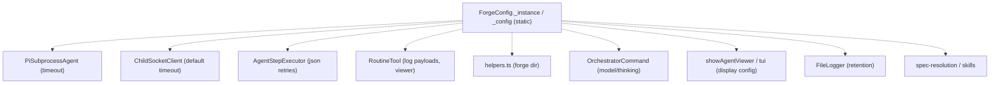

**Proposed fix - plain object + explicit injection:**

- `ForgeConfig.create()` already loads a frozen config object - keep that, but **return the config object**, and pass it explicitly through the composition root (`packages/cli/src/index.ts`). Every consumer that needs config declares it in its constructor. The composition root is already the single wiring point, so the change is mechanical.
- Kill the class: `loadForgeConfig(cwd): Promise<Readonly<ForgeConfig>>` + `registerSighupReload(config, onReload)` as a separate concern.
- `ConfigLoader` becomes the only config surface; accessor methods become plain defaults in `ForgeConfigDefaults` (they already exist there).
- Where passing config through 4 layers is painful (e.g. `RpcClient` options → `PiSubprocessAgent`), use explicit **options objects** (the `ExecuteTaskOptions` pattern already exists) rather than the global.

Interim step (M): keep `ForgeConfig` but make `getInstance()` throw with a migration hint; move all consumers to constructor injection in one PR per consumer.

---

### 3.4 P1-1: IPC tool skeleton duplicated 6 times

|            |                                                                                                                                                                   |
| ---------- | ----------------------------------------------------------------------------------------------------------------------------------------------------------------- |
| **Files**  | `SpawnAgentTool.ts`, `SendTaskTool.ts`, `GetAgentResultTool.ts`, `ListAgentsTool.ts`, `DestroyAgentTool.ts` (+ `SetFlowParamTool`/`SetSessionNameTool` partially) |
| **Impact** | ~30 identical lines per tool: `NO_CLIENT_ERROR` const, null-client guard, `signal?.throwIfAborted()`, try/catch → error-details block                             |
| **Effort** | S                                                                                                                                                                 |

All five agent-management tools share the exact same `execute()` skeleton (client-null branch → abort check → `client.request(type, params)` → `JSON.stringify(result)` content → catch → `{error: message}` details). Fix:

```typescript
// shared/src/tools/IpcTool.ts
export abstract class IpcTool<TParams extends TSchema, TResult> extends Tool<
  TParams,
  TResult | { error: string }
> {
  constructor(protected readonly client: ChildSocketClient | null) {
    super();
  }
  protected abstract readonly messageType: SocketMessage["type"];
  protected async ipc(params: unknown, timeout?: number, signal?: AbortSignal) {
    if (!this.client) {
      signal?.throwIfAborted();
      return NO_CLIENT_ERROR;
    }
    signal?.throwIfAborted();
    try {
      const result = await this.client.request(this.messageType, params, timeout, signal);
      return {
        content: [{ type: "text", text: JSON.stringify(result, null, 2) }],
        details: result,
      };
    } catch (error) {
      /* one error shape */
    }
  }
}
```

Each tool shrinks to `name/label/description/parameters/renderers` plus a one-line `execute` calling `this.ipc(params, ...)`. Net removal ~150 lines and a single place to change IPC-tool error semantics.

---

### 3.5 P1-2: `RoutineTool` is a god class

|            |                                                                                                                                                                                                                  |
| ---------- | ---------------------------------------------------------------------------------------------------------------------------------------------------------------------------------------------------------------- |
| **Files**  | `cli/src/orchestrator/RoutineTool.ts` (~350 lines)                                                                                                                                                               |
| **Impact** | Implements `ToolDefinition` **and** `RoutineProgressState`; owns widget lifecycle, agent-viewer overlay lifecycle, parameter-schema building, description building, event subscription management, and execution |
| **Effort** | M                                                                                                                                                                                                                |

Responsibilities to extract:

1. **`RoutineToolSchema`** - `buildParamsSchema` + `buildDescription` are pure functions of `RoutineDefinition`; move to a free module (testable without a tool instance).
2. **`RoutineProgressFeed`** - owns subscriptions, the contribution accumulation (or the new projection from P0-2), and `resetState()`. Receives the tool's `onUpdate` callback.
3. **`AgentViewerLifecycle`** - the `showAgentViewer` + `viewerHandle` + `dispose` choreography is already half-extracted into `showAgentViewer`; finish the job so `RoutineTool.execute` only calls `openViewer(...)` and `viewerHandle?.dispose()`.

After extraction, `RoutineTool` becomes: schema fields + `execute()` that composes executor, feed, and viewer. Target ~120 lines.

---

### 3.6 P1-3: Four template/expression engines, one of them lying

|            |                                                                                                                                                                             |
| ---------- | --------------------------------------------------------------------------------------------------------------------------------------------------------------------------- |
| **Files**  | `FlowContext.resolve/resolveNested` (orchestrator), `ExpressionParser/ExpressionEvaluator` (loops), `fillTemplate` (dead), `OrchestratorCommand.resolveTask` (inline regex) |
| **Impact** | Divergent semantics, and **documented operators that do not exist**                                                                                                         |
| **Effort** | M                                                                                                                                                                           |

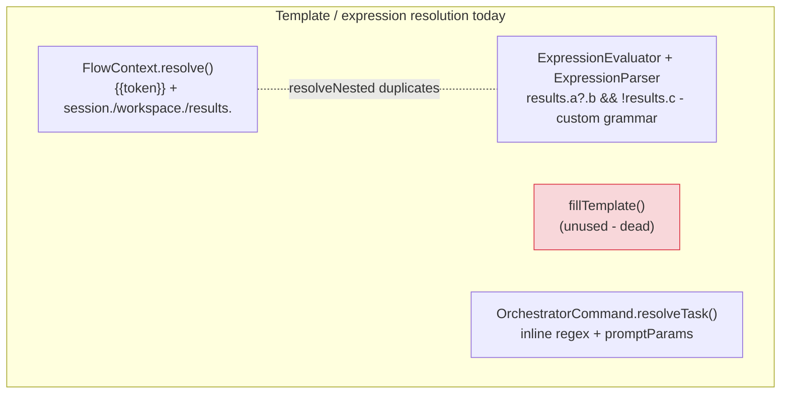

Verified inconsistency: `FlowInstruction.ts` documents the loop expression grammar as supporting `===` and `!==` ("strict equality / inequality"). The lexer in `ExpressionParser.ts` does not tokenize `=` at all. Running:

```
new ExpressionParser("results.builder?.parsed?.passed === true").parse()
→ ParseError: Unexpected character '=' at position 32
```

So flows using documented operators fail at load time (`FlowLoader.checkLoopExpression`). Either implement the operators or delete them from the docs - today the two disagree.

Proposed fix:

- **One** template resolver (`{{...}}` token substitution) used by `FlowContext`, `OrchestratorCommand`, and flow-file authors.
- **One** expression evaluator for loop conditions (parser + evaluator are already decent; add `===`/`!==` or drop them from the docs).
- Delete `fillTemplate`.
- Extract the `results.<id>.<path>` walking into a single helper shared by `resolveNested` and `resolvePath`, with **identical** missing-key semantics (currently `resolveNested` returns `""`, `resolvePath` throws - pick one and document it).

---

### 3.7 P1-4: `FlowContext` - "immutable" in name only + boilerplate

|            |                                                                                                                                            |
| ---------- | ------------------------------------------------------------------------------------------------------------------------------------------ |
| **Files**  | `cli/src/orchestrator/FlowContext.ts` (285 lines)                                                                                          |
| **Impact** | Misleading contract; 10 `with*` methods each re-specify 9 constructor fields; the mutable `store` is smuggled through "immutable" contexts |
| **Effort** | S-M                                                                                                                                        |

`FlowContext` is documented as an immutable value object, but it holds `store: FlowStateStore`, which `SessionStepExecutor` mutates in place (`context.store.set(...)`). Two objects (`params` map in context + `store`) hold overlapping state; `resolvePlaceholder` checks `params` first, then `session.` keys, then `workspace.`, with silent `""` fallbacks.

Proposed fix:

- Give `FlowContext` a private `copy(partial)` helper and make `with*` one-liners (`return this.copy({ results: next })`). Removes ~80 lines of pure repetition.
- Treat `FlowStateStore` honestly: either (a) remove it from `FlowContext` entirely and have `SessionStepExecutor` return an explicit `{ store }` mutation channel, or (b) rename `FlowContext`'s claim to "shallow-immutable, store explicitly mutable". Prefer (a) - the routine engine's docstring promises no shared mutable state, and it should deliver.
- Split `params` vs `store` responsibilities clearly: `params` = routine-call inputs; `store` = flow-global session. Currently `RoutineExecutor.run` merges them at entry, which is fine - just make it the _only_ merge point.

---

### 3.8 P1-5: `FlowStateStore extends Registry` (LSP violation)

|            |                                                                                                                                                                                   |
| ---------- | --------------------------------------------------------------------------------------------------------------------------------------------------------------------------------- |
| **Files**  | `cli/src/orchestrator/FlowStateStore.ts`                                                                                                                                          |
| **Impact** | A state store inherits `where()`, `getAll()`, `unregister()`, and `has()` - none of which make sense for it - and overrides `set()` to change the base contract (allow overwrite) |
| **Effort** | S                                                                                                                                                                                 |

`Registry<T>.set()` throws on duplicates; `FlowStateStore.set()` explicitly allows overwrites. That is inheritance-for-convenience, and the override silently changes the base class's contract for this subclass. The same question applies to `WorktreeRegistry` (which _is_ registry-shaped, so it is fine there).

Fix: make `FlowStateStore` a standalone class with exactly three methods (`get`, `set`, `entries`, `toObject`), backed by a `Map`. Delete the `extends Registry<string>`. The docstring's "extends Registry for consistency" is the smell itself - consistency is not inheritance.

---

### 3.9 P1-6: TypeBox schema patching + type casts

|            |                                                                                                                                                                                                                                                                                                                            |
| ---------- | -------------------------------------------------------------------------------------------------------------------------------------------------------------------------------------------------------------------------------------------------------------------------------------------------------------------------- |
| **Files**  | `cli/src/orchestrator/FlowInstruction.ts` (runtime `Object.defineProperty` patching, `routines.items.properties` reach-around), `executors/helpers.ts` (`containerSteps` cast through unknown), `RoutineRefStepExecutor.ts` (`routine.steps as FlowInstruction[]`), `FlowLoader.ts` (`flag in instruction` dynamic access) |
| **Impact** | The single most security/robustness-critical area (flow validation) relies on the most fragile TypeBox tricks                                                                                                                                                                                                              |
| **Effort** | M                                                                                                                                                                                                                                                                                                                          |

The recursive `steps` schema is built by mutating TypeBox schema objects at module load (`Object.defineProperty(ParallelInstructionSchema.properties, "steps", ...)`), then TS types are hand-augmented (`type ParallelInstruction = Type.Static<...> & { steps: FlowInstruction[] }`), and executors cast through `unknown` to read `steps`. `FlowLoader.collectIdsByFlag` uses `flag in instruction && instruction[flag] === true` - dynamic property checks that the compiler cannot verify against the instruction union.

Proposed fix - build the recursive schema properly:

- Construct the union with an explicit self-reference: `const FlowInstructionSchema = Type.Recursive((Self) => Type.Union([...schemas with Type.Array(Self) for steps]))`. `generate-flow-schema.ts` already emits a `$defs`-based JSON Schema, so the recursive form has a proven output target.
- Derive `FlowInstruction` types from the recursive schema (Type.Static supports this), killing the hand-augmented `& { steps }` types and the `containerSteps` cast helper.
- Replace `collectIdsByFlag` with an exhaustive `switch (instruction.type)` walk.

---

### 3.10 P1-7: Duplicated logic blocks (consolidation list)

| #   | Duplication                                                                                  | Locations                                                                                                                           | Fix                                                                                                                              |
| --- | -------------------------------------------------------------------------------------------- | ----------------------------------------------------------------------------------------------------------------------------------- | -------------------------------------------------------------------------------------------------------------------------------- |
| 1   | Tool-activation logic (Mode 1/2/3 + partial restriction merge + `activateToolRestrictions`)  | `SessionAgent.mount()` vs `extensions/spec-resolution.ts` (session vs subprocess path)                                              | Extract `applySpecToSession(pi, spec, projectRoot)` used by both                                                                 |
| 2   | Agent-completion emission (emit `agent-done`, push `agent_update`, error message extraction) | `ParentSocketServer.handleSendTask` (await path) vs `runInBackground`                                                               | Extract `finishExecution(...)` helper                                                                                            |
| 3   | `register` / `registerInstance` bodies                                                       | `CommandRegistry.ts` and `ToolRegistry.ts` (4 near-identical 15-line blocks)                                                        | Private `registerPrepared(instance)` helper                                                                                      |
| 4   | Bundled skills maintained in two places                                                      | `packages/cli/src/skills/` **identical** to `.forge/skills/` (10 files, currently byte-identical, no sync mechanism)                | Generate `.forge/skills/` from `packages/cli/src/skills/` during `forge init` (copy step + hash check), keep one source of truth |
| 5   | Git events logged twice                                                                      | `GitStepExecutor.ts` - `logger.debug("git-start", {...})` + `eventBus.emit("feature-forge:git-start", {...})` with the same payload | Drop the debug twin                                                                                                              |
| 6   | Workspace destruction choreography (find handle → destroy → remove from registry → untrack)  | `CleanupStepExecutor` vs `FlowExitCommand` vs `WorkspaceManager.destroy`                                                            | Make `WorkspaceManager.destroy` the single entry point                                                                           |
| 7   | `NO_CLIENT_ERROR` + error shape                                                              | 5 tool files                                                                                                                        | Part of P1-1 fix                                                                                                                 |
| 8   | JSONL line framing (buffer + split + trim + parse)                                           | `ParentSocketServer.handleConnection` vs `ChildSocketClient.handleData`                                                             | Extract `createLineFramer(onLine)` into shared                                                                                   |

---

### 3.11 P2-1: `WorkspaceStepExecutor` hardcodes the workspace name

|            |                                                                                                                                                                                                                                                                       |
| ---------- | --------------------------------------------------------------------------------------------------------------------------------------------------------------------------------------------------------------------------------------------------------------------- |
| **Files**  | `cli/src/orchestrator/executors/WorkspaceStepExecutor.ts:93`                                                                                                                                                                                                          |
| **Impact** | `context.withWorkspace("ws", handle).withResult("ws", ...)` ignores `instruction.id`; two workspace instructions in one routine silently overwrite each other; `{{workspace.<name>}}` resolution and `CleanupStepExecutor` iterate names that can only ever be `"ws"` |
| **Effort** | S                                                                                                                                                                                                                                                                     |

The `implement` flow gets away with it only because its workspace instruction is literally `id: "ws"`. Any flow author writing `{type: "workspace", id: "docs-ws"}` gets results under `ws`, template tokens `{{workspace.docs-ws}}` resolving to `""`, and cleanup-by-name broken.

Fix: `context.withWorkspace(instruction.id, handle).withResult(instruction.id, ...)`. Check `RoutineExecutor.buildResult`'s "backwards-compat: single-workspace flows expect `workspace` on the top-level result" path still works (it takes the first entry - unaffected).

---

### 3.12 P2-2: `WorkspaceManager` API names vs reality

|            |                                                                                                                                                                                                                                                  |
| ---------- | ------------------------------------------------------------------------------------------------------------------------------------------------------------------------------------------------------------------------------------------------ |
| **Files**  | `cli/src/workspace/WorkspaceManager.ts`                                                                                                                                                                                                          |
| **Impact** | `destroy(workspaceId)` / `get(workspaceId)` are actually keyed by **path** (`WorktreeRegistry` keys by `handle.path`). `FlowExitCommand` passes paths, so it works - but the parameter names invite a caller to pass a real id and silently fail |
| **Effort** | S                                                                                                                                                                                                                                                |

Also: `create()` tracks `sessionPaths.add(path)` while `destroy()` deletes by its `workspaceId` argument - currently consistent only because every caller passes a path. Rename parameters (`path`), add a doc note, and (optionally) a debug assertion that the value looks like a path.

---

### 3.13 P2-3: `ChildSocketClient.request` can hang silently

|            |                                                                                                                                                               |
| ---------- | ------------------------------------------------------------------------------------------------------------------------------------------------------------- |
| **Files**  | `cli/src/ipc/ChildSocketClient.ts` (request method)                                                                                                           |
| **Impact** | `this.socket?.write(...)` no-ops when the socket is null (disconnected) - the pending promise is then registered and waits for the full timeout with no error |
| **Effort** | S                                                                                                                                                             |

Fix: `if (!this.socket) return Promise.reject(new IpcConnectionError(...))` before writing. Also register the pending entry **before** writing (defensive ordering), and consider rejecting all `pending` entries on socket `close` so no caller waits out the timeout after a transport death.

Related: `ParentSocketServer.handleMessage` has no `default` case - unknown message types are silently dropped (a client then hangs until timeout). Add an explicit error response. And `start()` registers a fresh `session_shutdown` listener on every call - register once.

---

### 3.14 P2-4: Config knob that does nothing (`maxAgentEvents`)

|            |                                                                                                                                                                                                                                              |
| ---------- | -------------------------------------------------------------------------------------------------------------------------------------------------------------------------------------------------------------------------------------------- |
| **Files**  | `tui/src/state/AgentViewerState.ts:21` vs `shared/src/config/ForgeConfigSchema.ts:117`                                                                                                                                                       |
| **Impact** | `AgentViewerState` hardcodes `MAX_AGENT_EVENTS = 200`; the config system exposes `display.maxAgentEvents` (default 200). The user-facing knob exists, validates, and is **never read by the code that matters** - the state's sliding window |
| **Effort** | S                                                                                                                                                                                                                                            |

`AgentViewerOverlay.getConversation()` does use the config value for its _disk-load_ default, but the in-memory window in `AgentViewerState` ignores it. Same family of drift: `ScrollableBox`'s viewport height is hardcoded to `0.85` in `AgentDetailView.ts:96` while `OVERLAY_OPTIONS` honors `getDisplayMaxOverlayHeight()` - the detail scroll height and overlay maxHeight can disagree. Either wire the config values through or delete the config keys.

---

### 3.15 P2-5: Progress events masquerading as results + hand-maintained channel list

|            |                                                                                                                                                                                                                                                                                                    |
| ---------- | -------------------------------------------------------------------------------------------------------------------------------------------------------------------------------------------------------------------------------------------------------------------------------------------------- |
| **Files**  | `cli/src/orchestrator/RoutineTool.ts` (`PROGRESS_CHANNELS`, handler's `onUpdate` block)                                                                                                                                                                                                            |
| **Impact** | The handler casts `event.details` to `Partial<RoutineResult>` and fabricates `results: {}`, `session: store.toObject()` per event - a fake result shape shipped on every progress tick. `PROGRESS_CHANNELS` is a manually maintained array of 18 channel names that can drift from `ForgeChannels` |
| **Effort** | S-M                                                                                                                                                                                                                                                                                                |

Fix: give streaming updates their own type (`RoutineProgressUpdate`) instead of a doctored `RoutineResult`; derive `PROGRESS_CHANNELS` from `ForgeChannels` (`Object.keys` of a typed record) so adding a channel updates the subscription automatically.

---

### 3.16 P2-6: `AgentStepExecutor.execute` - 200-line method, 5 phases inline

|            |                                                                                                                                                                                |
| ---------- | ------------------------------------------------------------------------------------------------------------------------------------------------------------------------------ |
| **Files**  | `cli/src/orchestrator/executors/AgentStepExecutor.ts`                                                                                                                          |
| **Impact** | Spec resolution, cwd resolution, spawn, JSON-retry loop, result building, and event emission all in one method; `ForgeConfig.getInstance()` called mid-method for retry limits |
| **Effort** | M                                                                                                                                                                              |

Split into private methods (`resolveSpecification`, `runWithJsonRetries`, `buildFailureResult`), move the correction prompt + retry loop into its own class (`JsonResultEnforcer`) so it can be unit-tested without a supervisor, and inject `jsonRetryMaxAttempts` via constructor (kills one more singleton call site).

---

### 3.17 P3: Hygiene list

| #   | Finding                                                                                                                                            | Location                                                                                         | Fix                                                                              |
| --- | -------------------------------------------------------------------------------------------------------------------------------------------------- | ------------------------------------------------------------------------------------------------ | -------------------------------------------------------------------------------- |
| 1   | Dead export `fillTemplate` (exported from `agents/specifications/index.ts`, no production usage)                                                   | `specifications/templates.ts`                                                                    | Delete                                                                           |
| 2   | Dead public method `buildEnvOverlay` (only mentioned in its own docstring)                                                                         | `shared/src/config/ConfigLoader.ts`                                                              | Delete or test + use                                                             |
| 3   | `ConsoleLogger` exported, never initialized in production (only `FileLogger.initialize()` is called)                                               | `shared/src/logging/ConsoleLogger.ts`                                                            | Delete or wire into a `--console-logs` mode                                      |
| 4   | `DynamicAgentSpecification.toJSON()` override that just calls `super.toJSON()`                                                                     | `specifications/DynamicAgentSpecification.ts`                                                    | Delete the override                                                              |
| 5   | `TOOL_PRESETS.readOnly` ≡ `reviewOnly` (identical arrays)                                                                                          | `specifications/constants.ts`                                                                    | Keep one (alias or delete `reviewOnly`)                                          |
| 6   | Duplicated class-level JSDoc block (appears twice verbatim)                                                                                        | `workspace/GitWorktreeProvider.ts`                                                               | Delete one                                                                       |
| 7   | Orphaned docstring fragment ("Maximum characters of raw agent output...") above an unrelated function                                              | `tui/src/views/AgentViewerOverlay.ts`                                                            | Delete                                                                           |
| 8   | Broken docstring numbering in `OrchestratorCommand` ("The command:" then jumps to item 2, no item 1)                                               | `commands/OrchestratorCommand.ts`                                                                | Rewrite                                                                          |
| 9   | `getOverlayOptions` returns `configHeight as "85%"` - a cast that lies                                                                             | `tui/src/views/AgentViewerOverlay.ts`                                                            | Type the field as `string` properly                                              |
| 10  | `renderCall` context typed `[key: string]: any` with eslint-disable                                                                                | `cli/src/orchestrator/RoutineTool.ts`                                                            | Narrow via a local interface                                                     |
| 11  | `console.warn`/`console.error` in library code (bypasses the logger)                                                                               | `ConfigLoader.ts:275`, `extensions/spec-resolution.ts:58`, `extensions/tool-restrictions.ts:219` | Use `logger`                                                                     |
| 12  | Magic numbers: shell timeout 120s, git timeout 60s, `maxBuffer` 10MB, `MAX_REVIEW_THREAD_PAGES` 5, preconnect 2000                                 | executors, `github.ts`                                                                           | Move to `ForgeConfigDefaults` / named constants                                  |
| 13  | Version drift: `typebox` 1.3.8 (root) vs 1.3.0 (packages); pi packages pinned `0.79.10` vs `0.79.8`; TypeScript `6.0.3` (root) vs `^5.0.0` (debug) | manifests                                                                                        | Single source via root devDeps + workspace `*` deps; check with `npm ls typebox` |
| 14  | `web` placeholder package with echo-only scripts adds turbo task noise                                                                             | `packages/web`                                                                                   | Delete until it has source (git history preserves it)                            |
| 15  | `logger.debug` + `eventBus.emit` twin logging (see 3.10 #5)                                                                                        | `GitStepExecutor.ts`                                                                             | Drop the debug twin                                                              |
| 16  | `FlowRegistrar` 10-field params bag destructured twice                                                                                             | `orchestrator/FlowRegistrar.ts`                                                                  | Pass a single `FlowRegistrarContext` object; drop the second destructuring       |
| 17  | `SkillResolver` mixes statics and instance state (`discoverAll` static creates `new SkillResolver(...)`)                                           | `specifications/skill-resolver.ts`                                                               | Plain functions + module-level constants                                         |
| 18  | `FlowLoader` - instance method `load()` + all-static validation methods                                                                            | `orchestrator/FlowLoader.ts`                                                                     | `FlowLoader` (instance) + `flowValidation.ts` (pure functions)                   |
| 19  | `TuiProgressReporter.ts` exports `TuiRoutineWidget` - file, test file, and class name disagree                                                     | `tui/src/progress/TuiProgressReporter.ts`, `tui/src/index.ts`                                    | Rename file to `TuiRoutineWidget.ts`                                             |
| 20  | Dead `avgLinesPerMessage` map written on every render, never read (the "#154 heuristic" comment claims it tracks perf but it influences nothing)   | `tui/src/views/AgentDetailView.ts:67,174`                                                        | Delete                                                                           |
| 21  | Em-dashes in user-facing display strings vs repo hyphen rule                                                                                       | `tui/src/progress/ProgressRenderer.ts`, `AgentViewerOverlay.ts`, `AgentDetailView.ts`            | Replace `—` with `-`                                                             |
| 22  | Widget separator shorter than header (icon width omitted)                                                                                          | `tui/src/progress/ProgressRenderer.ts`                                                           | Include icon width in separator computation                                      |
| 23  | `EventSubscriber` interface in `api.ts` exists for the tui/cli boundary but is unused                                                              | `tui/src/api.ts`                                                                                 | Use it in the P0-1 fix or delete                                                 |
| 24  | Duplicated pruning loops in `cleanup()` / `sweepAndPrune()` with subtly different rules                                                            | `orchestrator/progress/sharedStreamDir.ts`                                                       | Extract one `pruneByRetention()`                                                 |
| 25  | e2e helper: 3s socket-roundtrip `setTimeout` never cleared; `PROJECT_ROOT` via `URL.pathname` is Unix-fragile                                      | `e2e/helpers.ts`                                                                                 | `clearTimeout` on resolve; `fileURLToPath`                                       |
| 26  | `DEFAULT_LOG_LEVEL = DEBUG` contradicts config default `INFO` and is unused                                                                        | `shared/src/logging/LogLevel.ts`                                                                 | Delete or repurpose                                                              |
| 27  | Schema marks `logLevel`/`workspaceProvider`/`agents`/`defaultAgent` required while docs claim defaults exist                                       | `shared/src/config/ForgeConfigSchema.ts`                                                         | `Type.Optional` (defaults already supplied) or fix docs                          |
| 28  | Package-level `npm run test` broken in `packages/shared` ("No test files found"; root workspace `root` doesn't resolve from the package dir)       | `packages/shared/package.json`                                                                   | Package-local vitest config or invoke the root project explicitly                |

---

### 3.18 P0-4: `/flow:exit` followed by re-mount permanently leaks the orchestrator persona

|            |                                                                                                                                                    |
| ---------- | -------------------------------------------------------------------------------------------------------------------------------------------------- |
| **Files**  | `commands/OrchestratorCommand.ts`, `commands/FlowExitCommand.ts`, `agents/supervisors/InMemoryAgentSupervisor.ts`, `agents/agents/SessionAgent.ts` |
| **Impact** | **Verified logic bug**: persona injection and tool overrides can never be torn down after the second flow run in a session                         |
| **Effort** | S                                                                                                                                                  |

`OrchestratorCommand` caches `this.agent` and only creates a new one when falsy. `FlowExitCommand` destroys mounted agents via `supervisor.destroyAgent()`, which calls `agent.destroy()` **and removes the agent from the supervisor map**. On a second `/implement` in the same session:

1. The cached (destroyed, de-registered) agent is re-mounted - `mount()` re-sets `unmounted = false` and registers **another** `before_agent_start` handler (the pi SDK has no `off()`, see the comment in `SessionAgent.mount`), so the persona gets prepended multiple times per turn on every subsequent mount.
2. The agent is no longer in the supervisor map, so a second `/flow:exit` finds zero mounted agents, notifies "No active flow", and clears the registry - but **never tears down the persona/tool overrides**. The orchestrator persona leaks into the session permanently.

Not covered by tests (`OrchestratorCommand.test.ts` only tests re-invocation without an intervening destroy).

**Fix:** recreate the agent in `handler()` when `!this.agent?.isMounted` or `!this.supervisor.getAgent(this.agent.id)`. Add a regression test: mount → exit → re-mount → exit, asserting tool/persona restoration both times.

---

### 3.19 P0-5: The implement loop feeds the builder routine-ref envelopes instead of review findings

|            |                                                                                                                                                                               |
| ---------- | ----------------------------------------------------------------------------------------------------------------------------------------------------------------------------- |
| **Files**  | `flows/implement/flow.json`, `orchestrator/executors/RoutineRefStepExecutor.ts`, `orchestrator/executors/LoopStepExecutor.ts`                                                 |
| **Impact** | The build loop's core self-correction mechanism is broken: the builder's retry rounds receive no actionable feedback and can burn all 3 iterations without seeing what to fix |
| **Effort** | M                                                                                                                                                                             |

`run_build_loop` declares `accumulateFrom: ["call_review", "call_verify"]`, but since the routine-ref executor was introduced those ids hold the **envelope** result (`raw: {"passed":false,"flow":"review","routineCount":1,"routines":["inspect"]}`). The reviewer's actual P0/P1 findings live under runtime-namespaced keys (`call_review.review.review`) that cannot be referenced statically in `accumulateFrom`. `LoopStepExecutor` concatenates whatever raw strings those ids hold into `{{feedback}}` - so the builder sees envelopes, not findings.

**Fix:** include the inlined steps' outputs in the routine-ref `InstructionResult` (e.g. a `results` field with the namespaced step raws), and derive loop feedback from those; or have `LoopStepExecutor` flatten namespaced agent results when `accumulateFrom` targets a routine ref.

---

### 3.20 P1-8: `resolveModel` prototype-chain lookup returns broken configs

|            |                                                                                                                                             |
| ---------- | ------------------------------------------------------------------------------------------------------------------------------------------- |
| **Files**  | `shared/src/config/ModelResolver.ts`                                                                                                        |
| **Impact** | **Verified runtime bug**: model preset names like `"constructor"`, `"toString"`, `"__proto__"` hit `Object.prototype` via the `in` operator |
| **Effort** | S                                                                                                                                           |

Verified probe:

```
resolveModel("constructor", { smart: {...} }) → {"resolved":true}   // no `model` field - violates ResolvedModelConfig
```

Downstream consumers (factory, orchestrator command) receive a model config with no model identifier, silently corrupting model resolution for those preset names.

**Fix:** `Object.hasOwn(models, rawModel)` plus regression tests for prototype-chain keys.

---

### 3.21 P1-9: Frozen config is shallow - callers can corrupt `DEFAULT_FORGE_CONFIG`

|            |                                                                                                                                                                                                                                                                                                                                                                                                                                                                |
| ---------- | -------------------------------------------------------------------------------------------------------------------------------------------------------------------------------------------------------------------------------------------------------------------------------------------------------------------------------------------------------------------------------------------------------------------------------------------------------------- |
| **Files**  | `shared/src/config/ForgeConfigDefaults.ts`, `shared/src/config/ForgeConfig.ts`                                                                                                                                                                                                                                                                                                                                                                                 |
| **Impact** | `resolveConfig` hands out `worktreeSymlinks`, `specDirectories`, `display`, `dev` **by reference** from the defaults object; `Object.freeze` is shallow. Verified: `cfg.worktreeSymlinks.push(...)` and `cfg.display.maxAgentEvents = 1` mutate `DEFAULT_FORGE_CONFIG` process-wide, contradicting the module's immutability contract. The same pattern applies to `ForgeConfig.create`'s frozen config (`getDisplayConfig()` exposes a mutable nested object) |
| **Effort** | S-M                                                                                                                                                                                                                                                                                                                                                                                                                                                            |

**Fix:** deep-freeze the defaults (recursive freeze or `structuredClone` + freeze) and/or deep-clone shared nested structures in `resolveConfig`.

---

### 3.22 P1-10: `@feature-forge/shared` barrel re-exports type-only names as values - runtime crash

|            |                                                                                                                                                                                                                                                                                                                                 |
| ---------- | ------------------------------------------------------------------------------------------------------------------------------------------------------------------------------------------------------------------------------------------------------------------------------------------------------------------------------- |
| **Files**  | `shared/src/index.ts` (`export { AgentConfig, AgentModelConfig, ... } from "./config"`), `core/scripts/validate-flow.ts`                                                                                                                                                                                                        |
| **Impact** | **Verified runtime bug**: `import('@feature-forge/shared')` throws under tsx `SyntaxError: The requested module './config' does not provide an export named 'AgentConfig'` - which breaks `npm run flow:validate`. esbuild/tsup silently drop the missing re-exports, so tests and the shipped bundle pass and CI never sees it |
| **Effort** | S                                                                                                                                                                                                                                                                                                                               |

Verified: `npx tsx -e "import('@feature-forge/shared')..."` → `import FAIL: The requested module './config' does not provide an export named 'AgentConfig'`. `validate-flow-json.ts` survives only because it deep-imports `@feature-forge/shared/src/helpers` (now `@feature-forge/core/src/helpers` after the shared merge) - the two scripts have diverged in import style for exactly this reason.

**Fix:** split into `export type { ... }` for the type-only names; add a runtime import smoke test to CI (e.g. run `flow:validate` in CI).

> **Status: SELF-HEALED by #229 (package restructure, ADR 0020).** The shared
> package was deleted (merged into core, D9) and core's index re-exports use
> `export type { ... }` for type-only names, so the crash mechanism no longer
> exists; `flow:validate` runs from `core/scripts` and no longer touches
> `@feature-forge/shared`.

---

### 3.23 P1-11: The coverage gate fails today

|            |                                                                                                                                                                                                            |
| ---------- | ---------------------------------------------------------------------------------------------------------------------------------------------------------------------------------------------------------- |
| **Files**  | `vitest.config.ts` (90% thresholds)                                                                                                                                                                        |
| **Impact** | `npm test -- --coverage` exits 1 (branches 88.53% vs 90%), which breaks the AGENTS.md Deterministic Gate validation loop. 2,172/2,172 tests pass - the gap is purely coverage configuration vs branch gaps |
| **Effort** | M                                                                                                                                                                                                          |

Worst pockets: `connectChildClient.ts` **0%** (33 production lines), `debug/.../test-loop-routine.ts` 5.47%, `cli/src/index.ts` 41.93%, e2e `helpers.ts` 65.07% (counted against the global threshold). Sub-80% branches: `ParentSocketServer.ts` 70.27, `FlowMapAware.ts` 72.22, `WorktreeRegistry.ts` 72.72, `registerTestCommands.ts` 73.68, `ExpressionEvaluator.ts` 76.92, `FlowInstruction.ts` 78.57.

**Fix:** close branch gaps in the sub-80% files, exclude test-support files (`test-utils.ts`, `e2e/helpers.ts`) from the global threshold, and add a suite for `connectChildClient.ts` (0% today, right where Phase 1 changes will land).

---

### 3.24 P2-7: `disposition_comments` shell-quoting bug and swallowed non-blocking failures

|            |                                                                                                                                                                                                                                                                                                                                                                                                                      |
| ---------- | -------------------------------------------------------------------------------------------------------------------------------------------------------------------------------------------------------------------------------------------------------------------------------------------------------------------------------------------------------------------------------------------------------------------- |
| **Files**  | `flows/resolve-pr-feedback/flow.json`, `flows/resolve-pr-feedback/orchestrator.md`                                                                                                                                                                                                                                                                                                                                   |
| **Impact** | `post_reply` uses `-f body='{{reply}}'` - any apostrophe in an LLM reply breaks/escapes the shell command (the repo's own `open_pr` guidance mandates `--body-file` + heredoc for exactly this reason). Both steps are `failFast: false`, so a failed post leaves the routine reporting success with the disposition silently unposted. `{{verdict}}` is also interpolated into a `case` pattern (injection surface) |
| **Effort** | S                                                                                                                                                                                                                                                                                                                                                                                                                    |

**Fix:** temp file + `--body-file` for the reply, `failFast: true` on `post_reply`, validate/quote the verdict.

---

### 3.25 P2-8: TUI correctness bugs (stale entries always "failed", rotation history gap)

|            |                                                                                                                                                                                                                                                                                                                                                                                                                                   |
| ---------- | --------------------------------------------------------------------------------------------------------------------------------------------------------------------------------------------------------------------------------------------------------------------------------------------------------------------------------------------------------------------------------------------------------------------------------- |
| **Files**  | `tui/src/state/AgentViewerState.ts`                                                                                                                                                                                                                                                                                                                                                                                               |
| **Impact** | (a) `prepopulateStreamFiles` hardcodes `passed: false, status: "done"` for every stale entry, so successful/cancelled agents from a previous session are mislabeled ✗ failed in `/agent:list` and the detail header. (b) `loadConversationEvents` returns **disk-only** results - after rotation the fresh file holds few lines while the in-memory tail and `.events.1.jsonl` archives are unreachable, shrinking detail history |
| **Effort** | S-M                                                                                                                                                                                                                                                                                                                                                                                                                               |

**Fix:** omit `passed` for stale entries (HEAD semantics render "completed" when undefined) or persist terminal status in a sidecar; merge disk tail with in-memory events (dedupe) and/or read archives when `count` exceeds the current file. Note: the `passed: false` behavior is test-locked (`AgentViewerOverlay.test.ts:2552`), so the test must be updated deliberately.

---

### 3.26 P2-9: Logging contract violations and undeclared dependencies

|            |                                                                                                                                                                                                                                                                                                                                                                                                                                                         |
| ---------- | ------------------------------------------------------------------------------------------------------------------------------------------------------------------------------------------------------------------------------------------------------------------------------------------------------------------------------------------------------------------------------------------------------------------------------------------------------- |
| **Files**  | `shared/src/logging/ConsoleLogger.ts`, `shared/package.json`                                                                                                                                                                                                                                                                                                                                                                                            |
| **Impact** | `ConsoleLogger` never consults the configured level - at `logLevel: "error"` it still prints debug/info, violating the documented "implementations may apply level filtering" contract (verified). `shared/package.json` does not declare `yaml` (runtime-imported by `ConfigLoader`, works only via hoisting from cli), has `typebox` in `devDependencies` despite runtime use (`ForgeConfigSchema`, `ConfigLoader`), and lacks `vitest` for its tests |
| **Effort** | S                                                                                                                                                                                                                                                                                                                                                                                                                                                       |

**Fix:** add a `shouldLog(candidate, Logger.getLogLevel())` guard in `ConsoleLogger` mirroring `FileLogger.writeEntry`; fix the manifest (yaml → dependencies, typebox → dependencies, vitest → devDependencies).

---

### 3.27 P2-10: Cross-flow routine-ref targets are not validated at load time

|            |                                                                                                                                                         |
| ---------- | ------------------------------------------------------------------------------------------------------------------------------------------------------- |
| **Files**  | `orchestrator/FlowLoader.ts` (`walkInstructions` skips `routine` steps), `orchestrator/FlowRegistrar.ts`                                                |
| **Impact** | A typo'd `target: "implement.run_build_loop"` fails mid-routine - after a workspace has been created and work has started - rather than at registration |
| **Effort** | S-M                                                                                                                                                     |

**Fix:** after `registerAll()` populates `flowMap`, walk every flow's routine-ref instructions and verify target flow names and (when dotted) routine ids; refuse registration on mismatch.

---

### 3.28 P2-11: Validation script exit codes and IPC lifecycle details

| #   | Finding                                                                                                                                                                                                                           | Location                                                              | Fix                                                                                               |
| --- | --------------------------------------------------------------------------------------------------------------------------------------------------------------------------------------------------------------------------------- | --------------------------------------------------------------------- | ------------------------------------------------------------------------------------------------- |
| 1   | `validate-flow.ts --all` **exits 0 when every flow fails**: `flows.size === 0` triggers an early return before the `failures.size > 0 → exit(1)` check (fixed in Phase -1, #225; 3.22 self-healed by #229)                        | `core/scripts/validate-flow.ts`                                       | Check failures before the early return                                                            |
| 2   | `ChildSocketClient.connect()` can be called repeatedly, overwriting `this.socket` and leaking the previous socket's handlers; pending requests are never rejected on `close`/`error` after connection                             | `cli/src/ipc/ChildSocketClient.ts`                                    | Guard double-connect; reject all pending on close/error (extends P2-3)                            |
| 3   | `ParentSocketServer.start()` registers a fresh `session_shutdown` listener per call; the `mkdtempSync` temp dir is never removed in `stop()`                                                                                      | `cli/src/ipc/ParentSocketServer.ts`                                   | Register once; `rmSync` in `stop()`                                                               |
| 4   | `OrchestratorCommand` swallows model/thinking-level resolution errors without even a `logger.warn`                                                                                                                                | `commands/OrchestratorCommand.ts`                                     | Log the caught error                                                                              |
| 5   | `AgentListCommand`/`ResearchCommand` failures invisible to the user (debug-only log, no `ctx.ui.notify`)                                                                                                                          | `commands/AgentListCommand.ts`, `commands/ResearchCommand.ts`         | Notify on failure                                                                                 |
| 6   | `resolve-pr-feedback/orchestrator.md` instructs importing `GitHubService` from `./packages/cli/src/github.ts` - a path that only exists inside the monorepo; `GitHubService` is not exported from the package index               | `flows/resolve-pr-feedback/orchestrator.md`                           | Remove the instruction or export the service and reference `node_modules/@feature-forge/cli/dist` |
| 7   | `forge-setup.js`: `--forge-dir` silently ignored when `--global` is set; `checkPrereqs` requires `pi` on PATH, which can fail `/forge:init` from a child session even though the runtime is present                               | `cli/scripts/forge-setup.js`, `commands/ForgeInitCommand.ts`          | Honor/reject the flag combo; relax the prereq when `FORGE_PARENT_SOCKET` is set                   |
| 8   | `ScrollableBox` renders impurely (`render()` mutates `scrollOffsetEnd`/`autoScroll`/`lastTotalLines` as "growth compensation"); stream events trigger up to two `requestRender()` calls (overlay + `ScrollableBox.onStreamEvent`) | `tui/src/components/ScrollableBox.ts`, `AgentViewerOverlay.ts`        | Move compensation to an explicit `onContentChange` hook; dedupe render requests                   |
| 9   | `agent-done` for a destroyed agent renders as "started" (status falls back to `Spawned` when the agent is no longer queryable)                                                                                                    | `tui/src/views/AgentViewerOverlay.ts`                                 | Carry terminal status in the payload or derive `done`/`error` from `passed`                       |
| 10  | Full `SelectList` rebuild per stream event: `pushStreamEvent` bumps `version`, `AgentListView.ensureUpToDate` rebuilds O(agents) per event during live streams                                                                    | `tui/src/state/AgentViewerState.ts`, `tui/src/views/AgentListView.ts` | Debounce rebuilds or update items in place                                                        |

---

## 4. What Is Good (keep it)

For balance, the parts that should not be touched:

- **The deterministic Orchestrator vs LLM split** (ADR 0007) - `RoutineExecutor` following a flow file while `SessionAgent` drives it is a clean, unusual, and correct separation.
- **The Agent hierarchy** (`Agent` → `SubprocessAgent`/`SessionAgent`, structural `isSubprocessAgent` guard) - the slim base with family-specific interaction contracts is exactly right.
- **The IPC design** - newline-delimited JSON over a Unix socket with correlation ids, push events, and a single code path for parent/child tool calls (loopback) is sound; only the framing duplication (3.10 #8) needs extraction.
- **Event-bus discipline** - `TypedEventBus` confining all `as` casts to one file is the right instinct; it just lives in the wrong package (P0-1).
- **ADR discipline** - 15 ADRs covering real decisions. New structural changes from this document should add ADRs (e.g. "0016-display-projection-extraction", "0017-config-injection").

---

## 5. Target Architecture

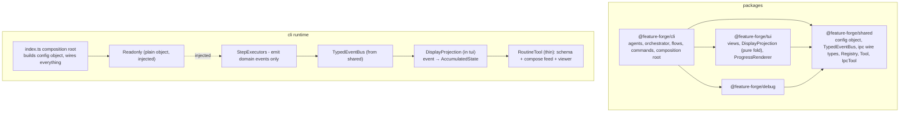

Key properties of the target:

1. **Acyclic package graph** - every edge is declared in `package.json`.
2. **Engine emits, UI projects** - executors have zero display code.
3. **No service locators** - config is a plain injected object; the only module-level state left is the logger (which should be an explicit dependency too, or at least a single, non-forwarding instance).
4. **One template resolver, one expression evaluator** - with docs matching the implementation.
5. **Single source of truth** for skills, tool skeletons, and session tool-activation.

---

## 6. Refactoring Roadmap

Each phase is independently shippable; ordering is by risk-reduction per effort.

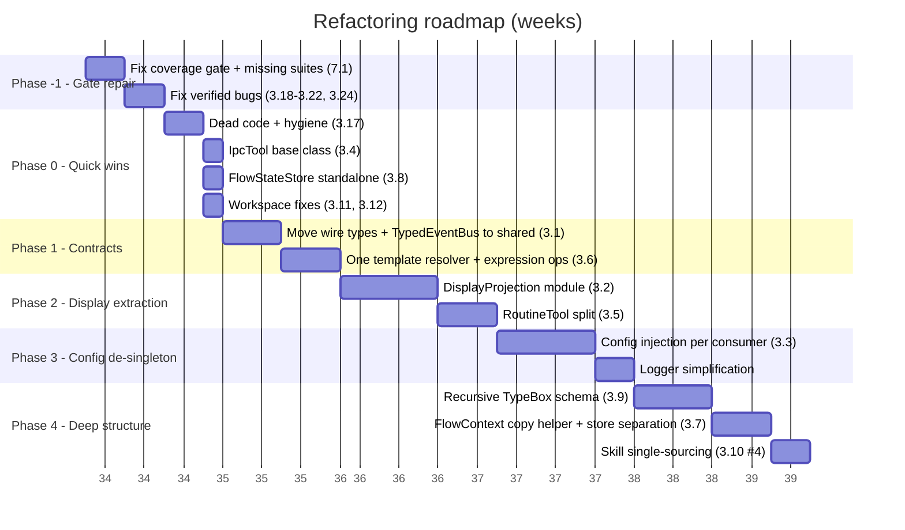

> **Roadmap status (2026-08-19):** phases **P1a** (3.1) and **P2a** (3.2) were
> consumed by issue #229's package restructure (ADR 0020) - the gantt rows
> below are kept as the original plan, not re-drawn. 3.1's cycle is gone by
> construction (wire types + `TypedEventBus` in core; `shared` and `tui` no
> longer exist); 2a's DisplayProjection landed as the final commit group of
> #229. Remaining roadmap work: p1b (the template/expression half of 3.6),
> then 2b (RoutineTool split) and 3a/3b, which now operate inside
> `core/src/config` and `core/src/logging`.

**Phase -1 - Gate repair + verified bugs (1 week)**
The coverage gate fails today and two verified bugs corrupt session state or defeat the build loop. These land first because they are small and make every later phase safer: fix the branch threshold (3.23), add the two missing suites (`connectChildClient`, `FlowStateStore` - see 7.2), fix the `/flow:exit` re-mount leak (3.18), the loop-feedback envelope bug (3.19), the `resolveModel` prototype leak (3.20), the shallow freeze (3.21), the shared barrel crash (3.22), and the `disposition_comments` quoting bug (3.24).

**Phase 0 - Quick wins (1 week)**
Dead code removal, `IpcTool` base, `FlowStateStore` de-inheritance, workspace name/path fixes, socket null guard, logger/console consistency. Pure deletions and extractions with existing tests as the safety net.

**Phase 1 - Contracts (1 week)** - p1a **consumed by #229**:
Move `TypedEventBus` + IPC wire types to `@feature-forge/shared`; kill the `tui → cli` edge. Unify template resolution; fix the `===`/`!==` doc-vs-lexer mismatch. (The move half is done - wire types + `TypedEventBus` are in core and the cycle is dead; the template/expression half, p1b, is still open.)

**Phase 2 - Display extraction (1.5 weeks)** - p2a **consumed by #229**:
Replace the dual push/pull display mechanism with the single `DisplayProjection` fold; delete `getDisplayContribution`/`registerDisplayHandler` from all executors; split `RoutineTool`. (The projection fold landed in #229's final commit group; the remaining work is the 2b RoutineTool split on the new layout.)

**Phase 3 - Config de-singleton (1 week)**
Inject config through the composition root, consumer by consumer; simplify the two-stage Logger singleton.

**Phase 4 - Deep structure (1.5 weeks)**
Recursive TypeBox schema (removing the `defineProperty` patching and `as` casts), `FlowContext` cleanup, skill single-sourcing with a sync check.

---

## 7. Test Architecture Assessment

The tests-audit agent measured the suite: **115 test files, ~39.4k test lines, 2,172 tests, all passing (~82s wall)**, with healthy unit ratios (cli 0.75, tui 0.71, shared 0.60 test:src lines) and disciplined practices (zero `.only`/`.skip`/`.todo` markers, no snapshots, only 4 raw `as any`). The problems:

### 7.1 Current test-infrastructure findings

| #   | Finding                                                                                     | Severity | Detail                                                                                                                                                                                                                                                           |
| --- | ------------------------------------------------------------------------------------------- | -------- | ---------------------------------------------------------------------------------------------------------------------------------------------------------------------------------------------------------------------------------------------------------------- |
| 1   | Coverage gate fails (see 3.23)                                                              | High     | Branches 88.53% vs 90%; `connectChildClient.ts` 0%, `debug` package has **no vitest project at all** (820 src lines outside the gate)                                                                                                                            |
| 2   | Three `test-setup.ts` copies (2 byte-identical + 1 import-path-only diff)                   | Medium   | `packages/cli/src/test-setup.ts`, `shared/...`, `tui/...` are each `await ForgeConfig.create()` - the test-architecture tax of the P0-3 singleton, paid three times. Phase 3a deletes all three                                                                  |
| 3   | `AgentViewerOverlay.test.ts` is a 4,577-line god test                                       | Medium   | 214 tests (8x its subject), 202 `as unknown as` casts incl. 146 `as unknown as AgentEvent` - fixtures built by hand instead of builders. The single largest cost item for Phase 2a                                                                               |
| 4   | Singleton-spy testing                                                                       | Medium   | `RoutineTool.test.ts` controls a config flag via `vi.spyOn(ForgeConfig, "getInstance").mockReturnValue(...)`; `index.test.ts`/`forge-skills.test.ts` `destroy()`/`create()` the singleton mid-file - cross-test leakage risk, and pins the singleton's existence |
| 5   | `node:child_process` mock duplicated 6 ways                                                 | Low      | One ~25-line hoisted mock is byte-identical in `GitStepExecutor.test.ts` and `ShellStepExecutor.test.ts`; 4 more files use different styles. Promote to `makeMockExecFile()` in test-utils                                                                       |
| 6   | Test utils leak into the production surface                                                 | Low      | `shared/src/test-utils.ts` (`createRpcClientMock`, imports `vi`) is re-exported from `shared/src/index.ts` and ships in `dist/`                                                                                                                                  |
| 7   | `FlowStateStore` has **no dedicated test suite**                                            | Medium   | Only 7 indirect references; Phase 0c would land with an incidental safety net. Add `FlowStateStore.test.ts` first                                                                                                                                                |
| 8   | `process.env` mutated in 6 test files with no central restore; zero `vi.resetModules` usage | Low      | Add a `withEnv` helper                                                                                                                                                                                                                                           |
| 9   | `ForgeConfig` accessor matrix barely tested (functions 56.92%)                              | Low      | No new tests needed - Phase 3a replaces the class with plain defaults (already 93.75% covered)                                                                                                                                                                   |

### 7.2 Refactor blast radius (tests affected per roadmap item)

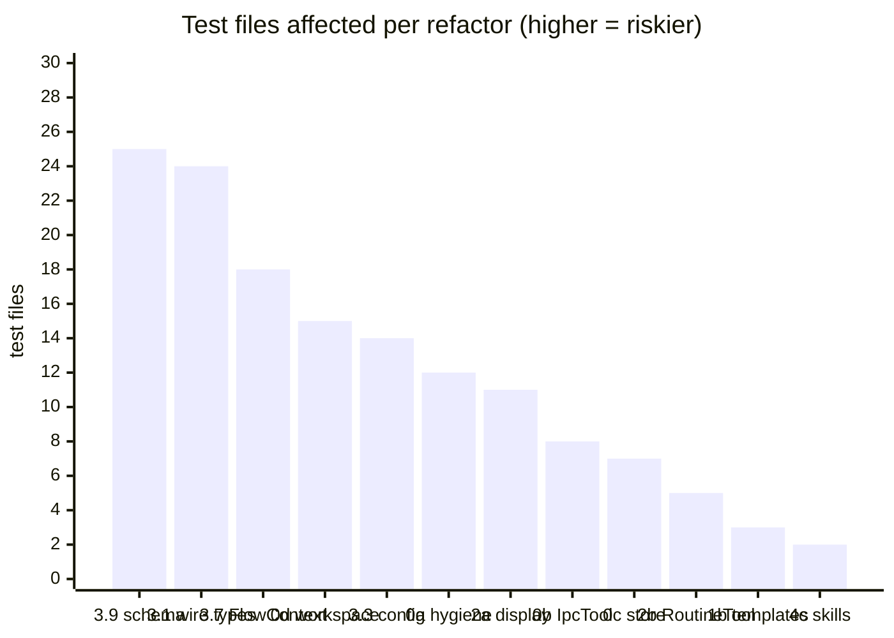

| Roadmap item         | Change                                | Affected test files     | Notes                                                                                                            |
| -------------------- | ------------------------------------- | ----------------------- | ---------------------------------------------------------------------------------------------------------------- |
| 3.9 / Phase 4a       | Recursive TypeBox schema              | **25**                  | Largest blast radius; `FlowInstruction.test.ts` (1,139) and `FlowLoader.test.ts` (1,009) are schema-shape-locked |
| 3.1 / Phase 1a       | `TypedEventBus` + wire types → shared | **24**                  | Import-path churn across cli + tui; two test files move packages                                                 |
| 3.7 / Phase 4b       | FlowContext copy/store split          | **18**                  | Every executor test re-touches the 10-field constructor                                                          |
| 3.11-3.12 / Phase 0d | Workspace id vs path                  | **15**                  | Add the missing `id != "ws"` regression case                                                                     |
| 3.3 / Phase 3a       | ForgeConfig de-singleton              | **14** (+3 setup files) | Singleton-spy tests convert to injected `mockForgeConfig()`                                                      |
| 3.17 / Phase 0a      | Dead code + hygiene                   | ~12                     | Deletion-safety only                                                                                             |
| 3.2 / Phase 2a       | DisplayProjection fold                | **11**                  | Includes the 4,577-line overlay test; `DisplayContributionRegistry.test.ts` deleted                              |
| 3.4 / Phase 0b       | IpcTool base class                    | 8                       | Per-tool tests keep behavior; error-shape assertions consolidate                                                 |
| 3.8 / Phase 0c       | FlowStateStore de-inheritance         | 7                       | **No direct suite - add one first**                                                                              |
| 3.5 / Phase 2b       | RoutineTool split                     | 5                       | `RoutineTool.test.ts` (1,275 lines) splits alongside the class                                                   |
| 3.6 / Phase 1b       | Template unification                  | 3                       | Only 3 files assert the four engines directly - add cross-engine parity tests                                    |
| 3.10#4 / Phase 4c    | Skill single-sourcing                 | 2                       | Add a sync-check test asserting bundled skills == `.forge/skills`                                                |

**Sequencing recommendation:** the suite is a good safety net for every phase except 3.8 (no direct suite) and 3.6 (thin direct coverage). Fix the coverage gate (3.23), add `connectChildClient.test.ts` and `FlowStateStore.test.ts`, and extract fixture builders from `AgentViewerOverlay.test.ts` **before** starting Phase 1+.

---

## 8. Grilling Appendix - anticipated questions

**Q: Why is the tui → cli import a real problem if everything bundles today?**
It works only because tsup resolves source files through workspace symlinks and nothing publishes `tui` alone. It blocks package-level testing, any future `exports` map on `cli`, tree-shaking guarantees, and it makes the declared dependency graph wrong - which turbo/CI caching and `npm ls` both trust. Structural lie + operational fragility.

**Q: The dual display mechanism (pull + register) has tests. Why rip it out?**
The tests test the machinery, not a user need. The projection fold is _more_ testable (pure function: event in, state out), removes ~200 lines of ceremony across 8 executors, and removes the O(executors × events) dispatch. The behavioral contract (widget shows agents, iterations, workspace, PR link) is unchanged.

**Q: Isn't the singleton config pragmatic in a pi extension where the SDK constructs the extension factory?**
The extension factory (`index.ts`) is already a proper composition root - it constructs every service by hand. The singleton is redundant there; it exists because wiring was skipped in deep layers. Injection is mechanical: each consumer already has a constructor; add one parameter.

**Q: FlowContext is 285 lines and works - why touch it?**
The "immutable" claim is load-bearing documentation for the concurrency model (`AGENTS.md` reiterates it). Today it is false (`store` mutates in place). Either the model or the claim must change; the refactor makes the code match the claim, and the `copy()` helper deletes 80 lines of boilerplate.

**Q: What is the risk that the roadmap breaks the extension?**
Each phase preserves external behavior (flows, tools, commands, IPC protocol, TUI output). The measured suite - 115 test files, 2,172 tests, ~82s wall - plus `npm run fix && lint && typecheck && test` gates every phase. Two caveats: the coverage gate must be repaired first (Phase -1), and the two phases with thin direct coverage (3.8 FlowStateStore, 3.6 template engines) get new dedicated suites before their refactors land. The only wire-level change (Phase 1) moves files, not formats - `FORGE_PARENT_SOCKET` protocol is untouched.

**Q: What about the `web` package and `debug` package?**
`web` should be deleted until it has code. `debug` should either gain a vitest project (its 820 source lines are currently outside the gate entirely) or, per the review's suggestion, its scenario factories should move into tui test fixtures and the production-only debug code be deleted.

**Q: The suite is green - why is a failing coverage gate P1-11?**
Because `AGENTS.md`'s Deterministic Gate explicitly requires `npm test -- --coverage` to pass before reporting `passed: true` - today that command exits 1. The gate is the repo's own contract; either the thresholds must be fixed or lowered explicitly. The review recommends closing the branch gaps (they cluster in IPC and flow-validation code, exactly where the roadmap will touch).

**Q: How do you know 3.18/3.20/3.22 are real bugs and not audit artifacts?**
3.20 and 3.22 were re-verified by the orchestrator: `resolveModel("constructor", ...)` → `{"resolved":true}` (no `model` field), and `import('@feature-forge/shared')` under tsx throws the `AgentConfig` export error. 3.18 follows directly from the code: `OrchestratorCommand` caches `this.agent`, `FlowExitCommand` destroys + de-registers it, so re-mount reuses a destroyed agent and re-registers `before_agent_start` handlers that pi never removes.

**Q: Which single change would you make first if you could only do one?**
P0-1 (move `TypedEventBus` + wire types to `shared`). It unlocks every other refactor, removes the cycle, and is ~1 file move plus import updates.

**Q: Given the blast radius, is the roadmap order still right?**
Mostly - but two adjustments come from the test audit: (1) Phase 4a (TypeBox schema) has the largest blast radius (25 files) and no user-facing payoff, so it is correctly last; (2) the missing `FlowStateStore` and `connectChildClient` suites must be added in Phase -1 so Phases 0c and 1a have real safety nets.

---

## 9. Validation Evidence

Baseline before this review (no code modified by this document):

```
$ npm run typecheck
Tasks:    10 successful, 10 total
Cached:    10 cached, 10 total
  Time:    85ms >>> FULL TURBO

$ npx vitest run            # via tests-audit agent
Test Files: 115 passed / Tests: 2,172 passed (~82s wall)

$ npm test -- --coverage    # FAILS today - see 3.23
Statements 92.76% | Branches 88.53% | Functions 91.20% | Lines 93.23%
ERROR: Coverage for branches (88.53%) does not meet global threshold (90%)
```

Targeted runtime probes (all re-verified by the orchestrator):

```
# 3.6 - documented === operator does not exist in the lexer
$ npx tsx -e "new (await import('./packages/cli/src/orchestrator/ExpressionParser.ts')).ExpressionParser('results.builder?.parsed?.passed === true').parse()"
ParseError: Unexpected character '=' at position 32

# 3.22 - shared barrel crashes at runtime under tsx (breaks flow:validate)
$ npx tsx -e "import('@feature-forge/shared').then(()=>console.log('import OK'), (e)=>console.log('import FAIL:', e.message))"
import FAIL: The requested module './config' does not provide an export named 'AgentConfig'

# 3.20 - resolveModel prototype-chain leak
$ npx tsx -e "import { resolveModel } from './packages/shared/src/config/ModelResolver.ts'; console.log(JSON.stringify(resolveModel('constructor', { smart: { model: 'smart-4', provider: 'anthropic', resolved: true } })))"
{"resolved":true}
```

---

## 10. Verification Report (2026-08-17)

Re-verified against `main` @ `4f2a11a` (the only commit since this review was written is `chore: migrate plan docs to .forge/plans`, which touches no source). Method: re-read every cited file/line for the P0-P2 findings, re-ran all three runtime probes verbatim, added a live probe for 3.21, re-ran the full validation loop, and spot-checked the P3 hygiene list and §7 test-infrastructure claims.

### 10.1 Result summary

Every P0, P1, and P2 finding **still holds**. No finding has been fixed and none was an audit artifact. Baseline re-measured:

| Metric                   | Documented                     | Re-measured                    |
| ------------------------ | ------------------------------ | ------------------------------ |
| `npm run typecheck`      | 10/10 pass                     | 10/10 pass                     |
| `npm test`               | 115 files / 2,172 tests (~82s) | 115 files / 2,172 tests (~70s) |
| `npm test -- --coverage` | branches 88.44% → **FAIL**     | branches 88.53% → **FAIL**     |

### 10.2 Per-finding status

| #    | Finding                              | Status                                         |
| ---- | ------------------------------------ | ---------------------------------------------- |
| 3.1  | P0-1 tui→cli cycle                   | Confirmed                                      |
| 3.2  | P0-2 display pipeline                | Confirmed (count corrected: 7 of 9 executors)  |
| 3.3  | P0-3 ForgeConfig singleton           | Confirmed (17 production consumers)            |
| 3.4  | P1-1 IPC tool skeleton x6            | Confirmed                                      |
| 3.5  | P1-2 RoutineTool god class           | Confirmed (344 lines)                          |
| 3.6  | P1-3 template engines + `===` bug    | Confirmed (probe)                              |
| 3.7  | P1-4 FlowContext                     | Confirmed (285 lines)                          |
| 3.8  | P1-5 FlowStateStore extends Registry | Confirmed                                      |
| 3.9  | P1-6 TypeBox patching                | Confirmed                                      |
| 3.10 | P1-7 duplication list                | Confirmed (items 1, 2, 4, 5, 8 re-checked)     |
| 3.11 | P2-1 `"ws"` hardcode                 | Confirmed (line 93)                            |
| 3.12 | P2-2 WorkspaceManager naming         | Confirmed                                      |
| 3.13 | P2-3 ChildSocketClient hang          | Confirmed                                      |
| 3.14 | P2-4 maxAgentEvents dead knob        | Confirmed                                      |
| 3.15 | P2-5 PROGRESS_CHANNELS               | Confirmed                                      |
| 3.16 | P2-6 AgentStepExecutor.execute       | Confirmed (~240-line method)                   |
| 3.17 | P3 hygiene list                      | Confirmed (20/28 re-checked, 0 stale)          |
| 3.18 | P0-4 `/flow:exit` persona leak       | Confirmed (code path)                          |
| 3.19 | P0-5 loop feedback envelope          | Confirmed                                      |
| 3.20 | P1-8 resolveModel                    | Confirmed (probe)                              |
| 3.21 | P1-9 shallow freeze                  | Confirmed (live probe)                         |
| 3.22 | P1-10 shared barrel                  | Confirmed (probe)                              |
| 3.23 | P1-11 coverage gate                  | Confirmed (88.53% vs 90%)                      |
| 3.24 | P2-7 disposition_comments            | Confirmed                                      |
| 3.25 | P2-8 TUI stale entries               | Confirmed                                      |
| 3.26 | P2-9 ConsoleLogger + manifest        | Confirmed                                      |
| 3.27 | P2-10 routine-ref validation         | Confirmed                                      |
| 3.28 | P2-11 lifecycle details              | Confirmed (items 1, 2, 3, 5, 9, 10 re-checked) |
| 7.1  | test-infra findings                  | Confirmed (1 correction, below)                |

### 10.3 Corrections and deltas

1. **Coverage drift (3.23, §9).** Branches 88.44% → 88.53%; statements 92.69% → 92.76%; functions 91.09% → 91.20%; lines 93.18% → 93.23%. Still fails the 90% branch threshold. Numbers updated in §1/§3.23/§7.1/§9.
2. **Executor count (3.2).** The dual display mechanism is implemented by 7 of 9 step executors (`Git` and `Parallel` do not), not "8 of 10". Substance unchanged.
3. **test-setup copies (7.1#2).** Only two of three are byte-identical (`cli` + `tui`); `shared` differs solely by import path (`./config` vs `@feature-forge/shared`). The "three copies to boot the singleton" claim stands.
4. **fillTemplate (3.6/3.17#1).** Production-dead (no consumer) but not untested - `templates.test.ts` covers it. "Dead export" is correct; deletion must also remove the test file.
5. **ResearchCommand (3.28#5).** It does `ctx.ui.notify` for usage/spec errors; the invisible failure is the un-caught `runAgent(...)` promise (no `.catch`, no log). `AgentListCommand` matches exactly (debug-only).
6. **Path shorthand.** The review cites `flows/implement/flow.json` and `flows/resolve-pr-feedback/flow.json`; actual locations are `packages/core/src/flows/definitions/...` (flows moved from `packages/cli/src/flows` to core in #229; verified there).
7. **Date typo.** Original header/gantt read 2025-08-17/18; corrected to 2026.

### 10.4 New observations (not in the original review)

- **Flow files are duplicated** between `.forge/flows/` and `packages/core/src/flows/definitions/` (previously `packages/cli/src/flows/`) - the 5 flow JSONs are byte-identical, mirroring the 3.10#4 skills duplication. Same single-sourcing fix applies (one source of truth + copy/sync at `forge init`).
- `.forge/worktrees/` contains leftover worktree dirs (`ws-03a8859d`, `ws-3f25704b`, `ws-df09a612`, `ws-f0b88079`) - workspace-cleanup hygiene, outside the code findings above.
